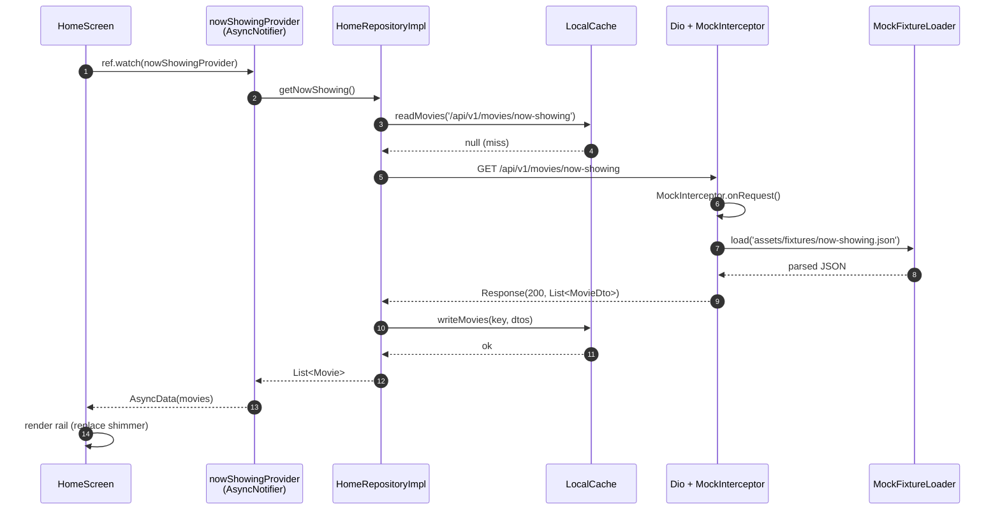
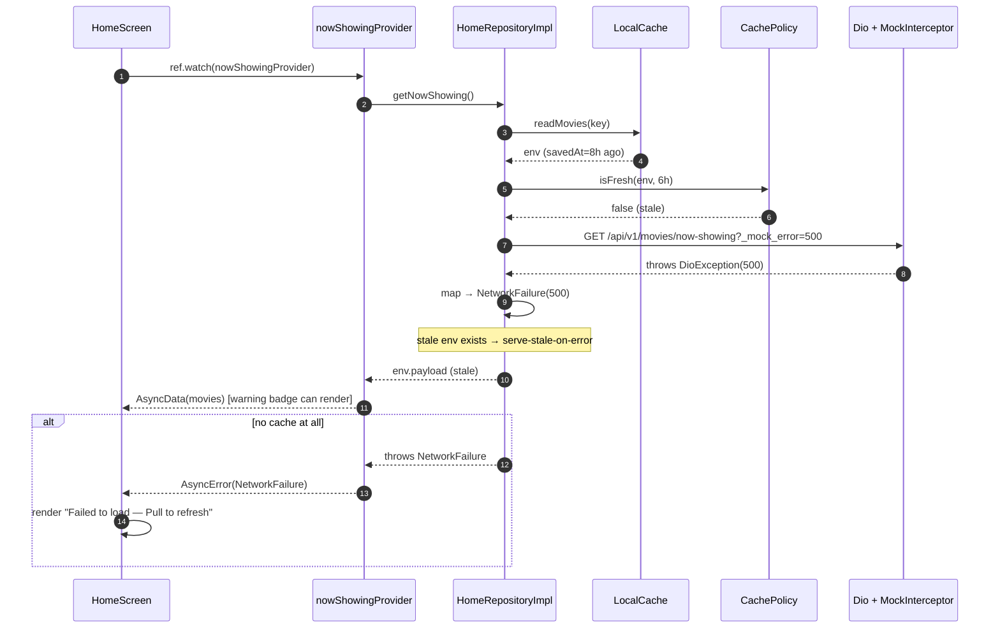

# LLD — ADF Cinema Home MVP

> Companion to [HLD](../plans/reports/hld-home-mvp.md). Locks contracts + flows for the two foundational subsystems. `features/home` consumes these via `HomeRepository`; widget/provider internals remain HLD-level.

---

## 1. Scope & Non-Goals

**In scope (this LLD)**
- `core/network/` — `DioClient`, `MockInterceptor`, fixture loader, latency/error simulation, headers.
- `core/storage/` — `HiveBootstrap`, box schema, `TypeAdapter`s, TTL envelope, `CachePolicy`, stale-while-revalidate (SWR) semantics.
- `core/errors/Failure` taxonomy (shared by both).
- 4 sequence diagrams covering user-visible flows.
- `HomeRepository` interface contract (the boundary between this LLD and feature code).

**Out of scope (covered at HLD level only)**
- Widget tree, Riverpod notifiers, navigation, theming codegen, repository implementation internals beyond the interface contract.

---

## 2. Module Layout (this LLD owns)

```
lib/core/
├── network/
│   ├── dio_client.dart            # factory + interceptor wiring
│   ├── mock_interceptor.dart      # matches /api/v1/* → fixture
│   ├── mock_fixture_loader.dart   # rootBundle asset reader + JSON parse
│   └── network_config.dart        # base URL, timeouts, mock flag
├── storage/
│   ├── hive_bootstrap.dart        # init, register adapters, open boxes
│   ├── cache_envelope.dart        # {payload, savedAt, schemaVersion}
│   ├── cache_policy.dart          # TTLs + isFresh()
│   └── local_cache.dart           # typed read/write per box
└── errors/
    └── failure.dart               # sealed Failure hierarchy
assets/fixtures/
├── banners.json
├── now-showing.json
├── coming-soon.json
└── recommended.json
```

All files ≤ 200 LOC per project rule.

---

## 3. Cross-Cutting: Failure Taxonomy

`core/errors/failure.dart` — sealed class consumed by **both** network and storage. Repository converts low-level exceptions to `Failure` before throwing across module boundary.

```dart
sealed class Failure implements Exception {
  final String message;
  final Object? cause;
  const Failure(this.message, [this.cause]);
}

final class NetworkFailure   extends Failure { final int? statusCode; }
final class TimeoutFailure   extends Failure {}
final class ParseFailure     extends Failure { final String? path; }
final class CacheReadFailure extends Failure { final String boxName; }
final class CacheWriteFailure extends Failure { final String boxName; }
final class FixtureMissingFailure extends Failure { final String assetPath; }
final class UnknownFailure   extends Failure {}
```

**Mapping rules**
| Source | Failure |
|---|---|
| `DioException.connectionTimeout / receiveTimeout` | `TimeoutFailure` |
| `DioException` 4xx/5xx | `NetworkFailure(statusCode: …)` |
| `FormatException` / JSON decode | `ParseFailure` |
| Hive `HiveError` on read | `CacheReadFailure` |
| Hive write error | `CacheWriteFailure` |
| Missing fixture asset | `FixtureMissingFailure` |
| anything else | `UnknownFailure` |

`toString()` excludes `cause` in release builds (avoid leaking stack). Both modules throw — Riverpod's `AsyncValue.error` carries the `Failure` to UI (`.when(error: …)`).

---

## 4. core/network — Detailed Contracts

### 4.1 `network_config.dart`

Single source of network constants. Switchable mock mode by build-time `--dart-define`.

```dart
class NetworkConfig {
  static const String baseUrl    = 'https://api.adf-cinema.local';
  static const Duration connect  = Duration(seconds: 5);
  static const Duration receive  = Duration(seconds: 10);
  static const bool useMock      = bool.fromEnvironment('USE_MOCK', defaultValue: true);
  static const Duration mockMinLatency = Duration(milliseconds: 120);
  static const Duration mockMaxLatency = Duration(milliseconds: 320);
}
```

LOC budget: < 30.

### 4.2 `DioClient` (`dio_client.dart`)

Factory, not a singleton. Riverpod provider owns the instance.

**Public surface**
```dart
class DioClient {
  static Dio build({bool mock = NetworkConfig.useMock}) { … }
}
```

**Interceptor chain order (request → response)**
1. `LogInterceptor` (dev builds only, no headers/body in release).
2. `MockInterceptor` — **terminal** when `mock == true`; bypassed when `false`.
3. (future) `AuthInterceptor` — placeholder; not wired in MVP.

**BaseOptions**
- `baseUrl = NetworkConfig.baseUrl`
- `connectTimeout = NetworkConfig.connect`
- `receiveTimeout = NetworkConfig.receive`
- `responseType = ResponseType.json`
- `headers: { 'Accept': 'application/json', 'X-Client': 'adf-cinema/mvp' }`

LOC budget: < 60.

### 4.3 `MockInterceptor` (`mock_interceptor.dart`)

Terminal interceptor that **resolves requests entirely from fixtures**. Real Dio adapter is never reached when `mock == true`.

**Endpoint → fixture map**
| Method | Path pattern | Fixture asset | Auth bypass |
|---|---|---|---|
| GET | `/api/v1/home/banners` | `assets/fixtures/banners.json` | n/a (public) |
| GET | `/api/v1/movies/now-showing` | `assets/fixtures/now-showing.json` | n/a (public) |
| GET | `/api/v1/movies/coming-soon` | `assets/fixtures/coming-soon.json` | n/a (public) |
| GET | `/api/v1/movies/recommended` | `assets/fixtures/recommended.json` | **bypass** (HLD §7.8) |

Path matching: exact match on `options.path` after stripping query string. Unknown path → forward `RequestInterceptorHandler.next` (lets Dio's default adapter 404 in dev; documents missing fixture).

**Behavior**
1. Read `path` from `RequestOptions`.
2. Lookup fixture asset; if missing → `reject(DioException(type: badResponse, response: 404))`.
3. Simulate latency: `await Future.delayed(rand(mockMinLatency, mockMaxLatency))`.
4. Optional **error injection** via query param `?_mock_error=<code>`:
   - `500` → `reject(badResponse 500)`
   - `timeout` → `reject(connectionTimeout)`
   - `parse` → resolve with malformed body `'{not json'`
   - else → normal success
5. Load JSON via `MockFixtureLoader`.
6. `resolve(Response(data: parsed, statusCode: 200, requestOptions, headers))`.

**Pagination**: ignored in MVP. `?page` / `?limit` are accepted but fixtures return full list. Documented; real backend will honor.

**Determinism toggle**: when `--dart-define=MOCK_DETERMINISTIC=true`, `rand()` seeded with `0` → reproducible widget tests.

LOC budget: < 120.

### 4.4 `MockFixtureLoader` (`mock_fixture_loader.dart`)

```dart
class MockFixtureLoader {
  final AssetBundle bundle;            // injectable for tests
  final Map<String, dynamic> _cache;   // in-memory after first read
  MockFixtureLoader({AssetBundle? bundle}) : bundle = bundle ?? rootBundle, _cache = {};
  Future<dynamic> load(String assetPath);   // throws FixtureMissingFailure
}
```

- First call per path: `bundle.loadString` → `jsonDecode` → cache.
- Subsequent: O(1) return from `_cache`.
- `jsonDecode` failures → wrap as `ParseFailure`.
- Asset miss → `FixtureMissingFailure`.

LOC budget: < 50.

### 4.5 Fixture JSON schemas

Schemas mirror FSD §4 response bodies exactly so swap to real backend is field-compatible.

**`banners.json`** — `Array<Banner>`
```json
[
  { "id": "b1", "imageUrl": "https://m.media-amazon.com/.../poster.jpg",
    "targetUrl": "adf://movie/m1", "title": "Featured: Dune Part Three" }
]
```

**`now-showing.json` / `coming-soon.json` / `recommended.json`** — `Array<Movie>`
```json
[
  { "id": "m1", "title": "Dune Part Three",
    "posterUrl": "https://m.media-amazon.com/.../poster.jpg",
    "rating": 8.4, "releaseDate": "2026-11-20" }
]
```

Fields per endpoint (per FSD §4):
- `now-showing`: id, title, posterUrl, rating, releaseDate
- `coming-soon`: id, title, posterUrl, **expectedReleaseDate** (no rating)
- `recommended`: id, title, posterUrl, rating, **matchPercentage**

DTOs (in `features/home/data/dto/`, not this LLD) tolerate missing optional fields → `null`.

### 4.6 Error semantics summary

| Caller-visible Failure | Triggering condition |
|---|---|
| `TimeoutFailure` | Dio timeout OR `?_mock_error=timeout` |
| `NetworkFailure(statusCode=500)` | Dio 5xx OR `?_mock_error=500` OR fixture missing |
| `ParseFailure` | Malformed JSON OR `?_mock_error=parse` |
| `FixtureMissingFailure` (mock only) | Asset path not in pubspec assets list |

---

## 5. core/storage — Detailed Contracts

### 5.1 Box schema

Two Hive boxes, lazy-opened during bootstrap. Keys are endpoint paths to align with cache-key strategy from HLD §7.3.

| Box name | Key type | Value type | Purpose |
|---|---|---|---|
| `movies_cache` | `String` (endpoint path) | `CacheEnvelope<List<MovieDto>>` | Now Showing, Coming Soon, Recommended |
| `banners_cache` | `String` (endpoint path) | `CacheEnvelope<List<BannerDto>>` | Featured banners |

Why two boxes (not one): different TTLs (movies 6h, banners 1h), simpler eviction, smaller per-box index on read. Keeps `LocalCache` API symmetric.

**Schema version**: `kSchemaVersion = 1`. Stored in every envelope. Read-side compares; mismatch → treat as miss + log + delete entry.

### 5.2 `CacheEnvelope` (`cache_envelope.dart`)

Generic wrapper for every cached payload.

```dart
@HiveType(typeId: 0)
class CacheEnvelope<T> {
  @HiveField(0) final T payload;
  @HiveField(1) final int savedAtEpochMs;  // DateTime.now().millisecondsSinceEpoch
  @HiveField(2) final int schemaVersion;   // == kSchemaVersion at write time

  const CacheEnvelope({required this.payload, required this.savedAtEpochMs, required this.schemaVersion});

  DateTime get savedAt => DateTime.fromMillisecondsSinceEpoch(savedAtEpochMs);
  Duration get age => DateTime.now().difference(savedAt);
}
```

**TypeAdapter strategy**: Hive CE codegen emits adapter per **concrete T**. We register two: `CacheEnvelope<List<MovieDto>>` (typeId 1), `CacheEnvelope<List<BannerDto>>` (typeId 2). Plus `MovieDto` (typeId 3), `BannerDto` (typeId 4). Reserved typeIds 5-15 for future entities.

| typeId | Type |
|---|---|
| 0 | `CacheEnvelope` base (generic stub) |
| 1 | `CacheEnvelope<List<MovieDto>>` |
| 2 | `CacheEnvelope<List<BannerDto>>` |
| 3 | `MovieDto` |
| 4 | `BannerDto` |

LOC budget: < 50 (rest is generated).

### 5.3 `CachePolicy` (`cache_policy.dart`)

Pure functions + constants. No I/O. Easy unit-testable.

```dart
class CachePolicy {
  static const Duration moviesTtl  = Duration(hours: 6);
  static const Duration bannersTtl = Duration(hours: 1);

  static bool isFresh<T>(CacheEnvelope<T> env, Duration ttl) => env.age < ttl;
  static bool isStale<T>(CacheEnvelope<T> env, Duration ttl) => !isFresh(env, ttl);

  /// Returns true iff schema in envelope matches current.
  static bool isCompatible<T>(CacheEnvelope<T> env) => env.schemaVersion == kSchemaVersion;
}
const int kSchemaVersion = 1;
```

**Edge cases**
- Clock skew (user changes device clock backward): `age` may go negative → treated as fresh; acceptable for MVP (no security/billing implication).
- TTL = 0 (forced refresh): callers pass `Duration.zero` → always stale.

LOC budget: < 40.

### 5.4 `LocalCache` (`local_cache.dart`)

Typed wrapper around Hive boxes. **Only public storage API** — boxes are private to this file.

```dart
class LocalCache {
  Future<CacheEnvelope<List<MovieDto>>?>  readMovies(String key);
  Future<void> writeMovies(String key, List<MovieDto> payload);

  Future<CacheEnvelope<List<BannerDto>>?> readBanners(String key);
  Future<void> writeBanners(String key, List<BannerDto> payload);

  Future<void> evict(String boxName, String key);
  Future<void> clearAll();   // dev/debug only
}
```

**Read semantics**
1. Open box if not already open.
2. `box.get(key)` → nullable envelope.
3. If `null` → return `null`.
4. If `!isCompatible(env)` → silently delete + return `null` (treat as miss).
5. Else return envelope (caller checks freshness via `CachePolicy`).

**Write semantics**
1. Build envelope with `now()` and `kSchemaVersion`.
2. `box.put(key, env)`.
3. Wrap any `HiveError` → `CacheWriteFailure`.

LOC budget: < 100.

### 5.5 `HiveBootstrap` (`hive_bootstrap.dart`)

Called once from `main()` before `runApp`.

```dart
Future<void> bootstrapHive() async {
  final dir = await getApplicationDocumentsDirectory();
  Hive.init(dir.path);
  Hive
    ..registerAdapter(MovieDtoAdapter())            // typeId 3
    ..registerAdapter(BannerDtoAdapter())           // typeId 4
    ..registerAdapter(CacheEnvelopeMoviesAdapter()) // typeId 1
    ..registerAdapter(CacheEnvelopeBannersAdapter()); // typeId 2
  await Future.wait([
    Hive.openBox<CacheEnvelope<List<MovieDto>>>('movies_cache'),
    Hive.openBox<CacheEnvelope<List<BannerDto>>>('banners_cache'),
  ]);
}
```

**Failure mode**: if `openBox` throws (corrupt file) → delete box file + retry once → if still fails, log + open in-memory fallback (`Hive.openBox(..., bytes: Uint8List(0))`). App still launches.

LOC budget: < 80.

### 5.6 Cache key convention

Endpoint path (no query string) is the cache key. Examples:
- `/api/v1/home/banners`
- `/api/v1/movies/now-showing`
- `/api/v1/movies/coming-soon`
- `/api/v1/movies/recommended`

Pagination not cached in MVP (only first page exists in fixture).

---

## 6. Boundary Contract: `HomeRepository`

The single seam between this LLD's modules and `features/home`. Implementation lives in `features/home/data/` (HLD-level).

```dart
abstract class HomeRepository {
  /// Throws Failure. Honors SWR: returns cached immediately if fresh,
  /// else fetches, caches, returns.
  Future<List<Movie>>  getNowShowing({bool forceRefresh = false});
  Future<List<Movie>>  getComingSoon({bool forceRefresh = false});
  Future<List<Movie>>  getRecommended({bool forceRefresh = false});
  Future<List<Banner>> getBanners({bool forceRefresh = false});
}
```

**SWR algorithm (shared by all four methods)**
```
1. if !forceRefresh:
     env = localCache.read(key)
     if env != null && CachePolicy.isFresh(env, ttl):
        return env.payload.toEntities()
2. try:
     dtos = remote.fetch()
     localCache.write(key, dtos)
     return dtos.toEntities()
   catch Failure f:
     if env != null (stale fallback):
        return env.payload.toEntities()   // serve-stale-on-error
     else: rethrow f
```

**Stale-fallback** is critical for offline UX: if cache exists but is stale AND network fails, serve stale rather than error. UI may show a passive "data may be outdated" badge (HLD-level).

---

## 7. Sequence Diagrams

### 7.1 Cold start (cache miss → network → cache write)



### 7.2 Warm start (cache hit, fresh) — meets NFR < 500ms

```mermaid
sequenceDiagram
    autonumber
    participant UI as HomeScreen
    participant N as nowShowingProvider
    participant R as HomeRepositoryImpl
    participant L as LocalCache
    participant P as CachePolicy

    UI->>N: ref.watch(nowShowingProvider)
    N->>R: getNowShowing()
    R->>L: readMovies(key)
    L-->>R: CacheEnvelope (savedAt=2h ago)
    R->>P: isFresh(env, moviesTtl=6h)
    P-->>R: true
    R-->>N: env.payload (no network)
    N-->>UI: AsyncData(movies) [< 500ms]
    Note over UI,R: NFR perf satisfied; no Dio call made.
```

### 7.3 Pull-to-refresh (forceRefresh=true)

```mermaid
sequenceDiagram
    autonumber
    participant UI as HomeScreen
    participant N as nowShowingProvider
    participant R as HomeRepositoryImpl
    participant L as LocalCache
    participant D as Dio + MockInterceptor

    UI->>N: ref.invalidate(nowShowingProvider)
    Note over N: AsyncNotifier rebuilds; build() runs
    N->>R: getNowShowing(forceRefresh: true)
    R->>D: GET /api/v1/movies/now-showing
    D-->>R: Response(200, List<MovieDto>)
    R->>L: writeMovies(key, dtos)  [overwrite]
    L-->>R: ok
    R-->>N: List<Movie>
    N-->>UI: AsyncData(movies)
    UI->>UI: dismiss RefreshIndicator
```

### 7.4 Error path — network 500 with stale cache fallback



---

## 8. Concurrency & Threading

- **Hive reads/writes**: async; serialize per box via Hive's internal lock. Concurrent reads on same key are safe.
- **Dio**: each call independent; HTTP/2 multiplexing handled by Dio + platform.
- **Parallel rail loads**: `HomeScreen` watches 4 providers; Riverpod fires `build()` concurrently → 4 parallel `getX()` calls → 4 parallel cache reads + (cache-miss case) 4 parallel Dio calls. Mock latency 120-320ms each → total < 500ms wall-time for cold start with all misses.
- **No global mutex**: each box+key pair acts as own resource; no cross-box dependency.

---

## 9. Testing Matrix (this LLD only)

| File | Test type | Cases |
|---|---|---|
| `mock_interceptor.dart` | Unit | path match success, path miss → 404, latency within bounds, `_mock_error=500` injection, `_mock_error=timeout`, `_mock_error=parse` returns bad body |
| `mock_fixture_loader.dart` | Unit | first read hits bundle, second read uses cache, missing asset → `FixtureMissingFailure`, malformed JSON → `ParseFailure` |
| `dio_client.dart` | Unit | interceptor order, base headers present, timeouts honored, mock=false skips MockInterceptor |
| `cache_policy.dart` | Unit | `isFresh` boundaries (age=ttl-1ms / ttl / ttl+1ms), negative age (clock skew), schemaVersion mismatch |
| `cache_envelope.dart` | Unit | Hive roundtrip per concrete T (movies, banners), `age` computed correctly |
| `local_cache.dart` | Unit (in-memory Hive) | read-miss null, write-then-read roundtrip, schema mismatch → silent delete, evict + clearAll, write error → `CacheWriteFailure` |
| `hive_bootstrap.dart` | Unit | adapters registered idempotently, corrupt-box recovery deletes + reopens |
| `failure.dart` | Unit | each subclass instantiable; `toString` redacts `cause` in release |

**Test framework**: `flutter_test` + `mocktail`. Hive in-memory via `Hive.init(tempDir)` with `setUp`/`tearDown`. AssetBundle stubbed via `TestAssetBundle`.

**Coverage target**: 85%+ on `core/network` + `core/storage` (foundational; high ROI).

---

## 10. Performance Budget

| Stage | Budget | Notes |
|---|---|---|
| Hive box open (startup, both boxes) | < 60ms | Native FFI; amortized at app launch |
| Cache read (per key) | < 15ms | Hive KV lookup + adapter decode |
| `isFresh` check | < 1ms | Pure math |
| Mock fixture first load | < 50ms | `rootBundle.loadString` ~10-30ms typical |
| Mock fixture cached load | < 1ms | In-memory map |
| Simulated network latency | 120-320ms | Configurable in `NetworkConfig` |
| **Warm Home cold start (cache hit, 4 keys)** | **< 200ms** | Comfortably under 500ms NFR |
| **Cold Home cold start (cache miss, 4 keys parallel)** | **< 500ms** | Bounded by max mock latency |

---

## 11. Risks & Mitigations (this LLD)

| Risk | Likelihood | Impact | Mitigation |
|---|---|---|---|
| Hive CE adapter typeId collision after future entities added | Med | High (corruption) | Reserved typeId table §5.2; document in code header; never reuse |
| Mock fixture diverges from FSD §4 contract → real backend breaks | Med | Med | Pin DTO fields per FSD; unit test parses fixture against DTO |
| Corrupt Hive file blocks app launch | Low | High | Bootstrap recovery: delete + reopen → in-memory fallback (§5.5) |
| Clock skew makes "fresh" cache look ancient (or vice versa) | Low | Low | Accept skew in MVP; document; future: trust server `Date` header |
| `_mock_error` query param leaks into real backend builds | Low | Med | `MockInterceptor` is only wired when `useMock=true`; param ignored otherwise |
| Schema bump forgotten when DTO changes shape | Med | Med | `kSchemaVersion` comment block listing reasons for each bump; PR checklist |
| Latency simulation flakes widget tests | Med | Low | `MOCK_DETERMINISTIC=true` in tests → seeded `rand()`; or stub interceptor |

---

## 12. Open Questions

1. Should `MockInterceptor` honor `?page=N` by slicing the fixture (more realistic) or ignore it (simpler)? **Currently: ignore.** Revisit when pagination ships in UI.
2. Do we want a `cache_stats` debug screen (hit/miss/age) for QA? Out of MVP; flag for backlog.
3. Stale-fallback UX: passive badge vs no indicator? Owned by `features/home` HLD; not blocking here.

---

## 13. Definition of Done (LLD scope)

- [ ] `core/network/` files created with contracts §4; all files < 200 LOC.
- [ ] `core/storage/` files created with contracts §5; all files < 200 LOC.
- [ ] `assets/fixtures/*.json` authored matching FSD §4 schemas (§4.5).
- [ ] `pubspec.yaml` lists the 4 fixtures under `flutter.assets`.
- [ ] Hive adapters generated via `build_runner` for typeIds 1-4.
- [ ] All §9 unit tests passing; coverage ≥ 85% on `lib/core/`.
- [ ] `flutter analyze` clean.
- [ ] `HomeRepository` interface (§6) committed in `features/home/domain/` so feature work can begin in parallel.

---

## 14. Decisions Locked

| # | Decision | Rationale |
|---|---|---|
| L1 | Two Hive boxes (movies + banners), not one | Different TTLs; cleaner eviction; smaller per-box index |
| L2 | Cache key = endpoint path (no query) | Stable, matches FSD §4 paths; pagination not cached in MVP |
| L3 | `CacheEnvelope` wraps every payload with `savedAtEpochMs` + `schemaVersion` | TTL-by-timestamp (KISS); future schema migration possible |
| L4 | `MockInterceptor` is terminal when `useMock=true`; real adapter never reached | Deterministic mock; swap by flipping `--dart-define=USE_MOCK=false` |
| L5 | Fixture loader caches parsed JSON in-memory | Avoid repeated `jsonDecode` across rebuilds; ~free RAM cost |
| L6 | Error injection via `?_mock_error=…` query param | Test error paths without code changes; only active in mock mode |
| L7 | Stale-fallback on network failure when cache exists | Better offline UX than hard error; aligns with SWR philosophy |
| L8 | Corrupt-box recovery: delete + reopen + in-memory fallback | App must always launch; data loss acceptable (it's a cache) |
| L9 | `kSchemaVersion = 1`; reserved typeIds 0-15 | Forward-compat envelope; explicit registry prevents collisions |
| L10 | `Failure` sealed class shared by network + storage | Single error vocabulary across `core/`; UI handles uniformly |

All LLD-scope decisions locked. Ready to break into implementation phases via `/plan`.
