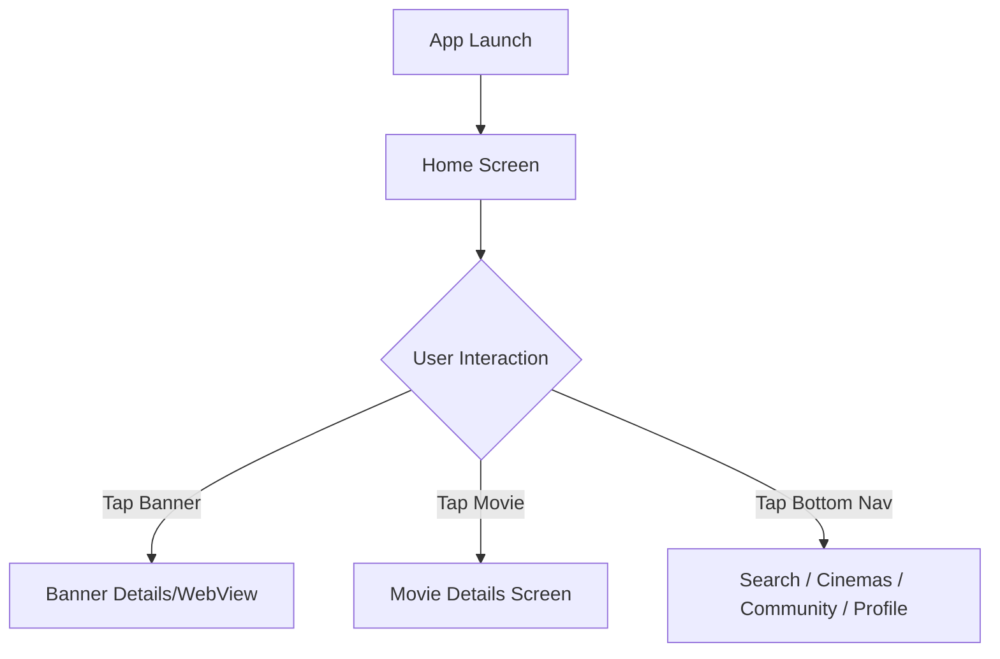

# Functional Specification Document

**Project**: ADF Demo
**Type**: mobile
**Version**: 1.0
**Last Updated**: 2026-05-27

---

## 1. Feature Specifications

### Home

**Description**: Main landing screen of the mobile application featuring a discovery platform for movies.

| ID | Requirement | Priority | Status |
|----|------------|----------|--------|
| FR-HOME-001 | Display a carousel banner of advertisements/featured content using Mocking from IMDB | High | Draft |
| FR-HOME-002 | Fetch and display a list of "Now Showing" movies using Mocking from IMDB | High | Draft |
| FR-HOME-003 | Fetch and display a list of "Coming Soon" movies using Mocking from IMDB | High | Draft |
| FR-HOME-004 | Fetch and display a list of "Recommended" movies using Mocking from IMDB | High | Draft |
| FR-HOME-005 | Display a bottom navigation bar with Home, Search, Cinemas, Community, Profile | High | Draft |

**Use Case References**: [docs/usecases/home/](../../../docs/usecases/home/)

---

## 2. Screen Descriptions

### Home Screen
- **Purpose**: Allow users to discover currently showing, upcoming, and recommended movies, and view featured banners.
- **Layout**: 
  - Top: Auto-scrolling banner carousel (IMDB mock data)
  - Middle 1: Horizontal scrollable list for "Now Showing"
  - Middle 2: Horizontal scrollable list for "Coming Soon"
  - Bottom: Horizontal scrollable list for "Recommended"
  - Persistent Bottom: Bottom Navigation Bar (Home, Search, Cinemas, Community, Profile)
- **Interactive Elements**: Banner taps, Movie card taps, Carousel swipe controls, Bottom Navigation tabs.
- **States**: 
  - Loading: Shimmer effect on banner and movie lists
  - Empty: "No movies found" message
  - Error: "Failed to load content, pull to refresh"
  - Success: Banners and movie lists displayed

## 3. Screen Flows

## 4. API Contracts

### Get Featured Banners
- **Method**: GET
- **Path**: `/api/v1/home/banners`
- **Auth**: Public
- **Request**: `None`
- **Response**: `Array<{id, imageUrl, targetUrl, title}>`
- **Error Codes**: 500

### Get Now Showing Movies
- **Method**: GET
- **Path**: `/api/v1/movies/now-showing`
- **Auth**: Public
- **Request**: `?page=1&limit=10`
- **Response**: `Array<{id, title, posterUrl, rating, releaseDate}>`
- **Error Codes**: 500

### Get Coming Soon Movies
- **Method**: GET
- **Path**: `/api/v1/movies/coming-soon`
- **Auth**: Public
- **Request**: `?page=1&limit=10`
- **Response**: `Array<{id, title, posterUrl, expectedReleaseDate}>`
- **Error Codes**: 500

### Get Recommended Movies
- **Method**: GET
- **Path**: `/api/v1/movies/recommended`
- **Auth**: Required
- **Request**: `?page=1&limit=10`
- **Response**: `Array<{id, title, posterUrl, rating, matchPercentage}>`
- **Error Codes**: 401, 500

## 5. Data Models

### Movie
| Field | Type | Constraints | Description |
|-------|------|-------------|-------------|
| id | String | PK | Unique identifier |
| title | String | Not Null | Movie title |
| posterUrl | String | URL | Link to movie poster image |
| status | Enum | 'now-showing', 'coming-soon', 'recommended' | Current status |

### Banner
| Field | Type | Constraints | Description |
|-------|------|-------------|-------------|
| id | String | PK | Unique identifier |
| imageUrl | String | URL | Mocked from IMDB content |
| title | String | | Banner title |

## 6. Business Rules & Validations

| ID | Rule | Applies To | Enforcement |
|----|------|-----------|-------------|
| BR-001 | Banners must auto-rotate every 5 seconds | Home Carousel | Client |
| BR-002 | "Now Showing", "Coming Soon", and "Recommended" should be cached locally | Home Lists | Client |

## 7. Non-Functional Requirements

| Category | Requirement | Target |
|----------|------------|--------|
| Performance | Home screen should load cached data within 500ms | < 500ms |
| Availability | API should gracefully handle IMDB mocking failures | 99.9% |
