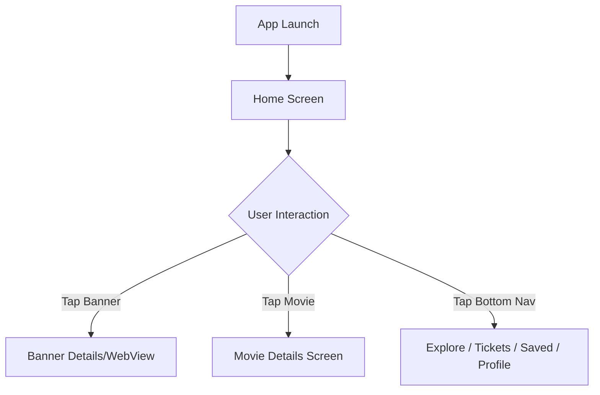

# Functional Specification Document

**Project**: ADF Demo
**Type**: mobile
**Version**: 1.1
**Last Updated**: 2026-05-28

---

## 1. Feature Specifications

### Home

**Description**: Main landing screen of the mobile application featuring a discovery platform for movies.

| ID | Requirement | Priority | Status |
|----|------------|----------|--------|
| FR-HOME-001 | Display a carousel banner of advertisements/featured content using Mocking from IMDB | High | Complete |
| FR-HOME-002 | Fetch and display a list of "Now Showing" movies using Mocking from IMDB | High | Complete |
| FR-HOME-003 | Fetch and display a list of "Coming Soon" movies using Mocking from IMDB | High | Complete |
| FR-HOME-004 | Fetch and display a list of "Recommended" movies using Mocking from IMDB | High | Complete |
| FR-HOME-005 | Display a bottom navigation bar with Home, Explore, Tickets (raised FAB), Saved, Profile | High | Complete |

**Use Case References**: [docs/usecases/home/](usecases/home/)

---

## 2. Acceptance Criteria

Each AC follows Given/When/Then. All ACs trace back to a functional requirement and the corresponding use case [UC-HOME-001](usecases/home/uc-home-001-home-banner.md).

| AC ID | FR | Scenario (Given / When / Then) | Linked UC |
|-------|-----|--------------------------------|-----------|
| AC-HOME-001-01 | FR-HOME-001 | Given the user opens Home with an active network connection / When `GET /api/v1/home/banners` responds `200` with ≥1 banner / Then the carousel renders the first banner within 500ms of response | UC-HOME-001 |
| AC-HOME-001-02 | FR-HOME-001 | Given the banner carousel is displayed with ≥2 banners / When 5 seconds elapse without user interaction / Then the carousel auto-advances to the next banner (BR-001) | UC-HOME-001 |
| AC-HOME-001-03 | FR-HOME-001 | Given the carousel is auto-rotating / When the user performs a horizontal swipe / Then auto-rotation halts immediately and resumes only after 5 seconds of inactivity | UC-HOME-001 |
| AC-HOME-001-04 | FR-HOME-001 | Given the banners endpoint returns `500` or is unreachable / When the Home screen loads / Then the banner area is replaced with a non-blocking placeholder and an inline retry affordance; the rest of Home continues to render | UC-HOME-001 |
| AC-HOME-002-01 | FR-HOME-002 | Given the user opens Home / When `GET /api/v1/movies/now-showing?page=1&limit=10` returns `200` with paginated data / Then the "Now Showing" row renders up to 10 cards and exposes `meta.hasNext` for pagination on scroll-end | UC-HOME-001 |
| AC-HOME-002-02 | FR-HOME-002 | Given the now-showing endpoint returns an empty `data` array / When the Home screen renders / Then the "Now Showing" section displays the "No movies available" placeholder (EF-2) | UC-HOME-001 |
| AC-HOME-002-03 | FR-HOME-002 | Given a previously cached now-showing payload exists (BR-002) / When the network is unavailable / Then the cached list is rendered with a subtle "offline" indicator instead of an error | UC-HOME-001 |
| AC-HOME-003-01 | FR-HOME-003 | Given the user opens Home / When `GET /api/v1/movies/coming-soon` returns `200` / Then the "Coming Soon" row renders movie cards with `expectedReleaseDate` formatted in the device locale | UC-HOME-001 |
| AC-HOME-003-02 | FR-HOME-003 | Given the coming-soon endpoint returns an empty `data` array / When the Home screen renders / Then the "Coming Soon" section is hidden or shows the "No movies available" placeholder | UC-HOME-001 |
| AC-HOME-004-01 | FR-HOME-004 | Given the user opens Home / When `GET /api/v1/movies/recommended` returns `200` (public endpoint) / Then the "Recommended" row renders cards sorted by `matchPercentage` descending | UC-HOME-001 |
| AC-HOME-004-02 | FR-HOME-004 | Given the recommended endpoint is called / When the response returns `200` with data / Then cards display with rating and matchPercentage | UC-HOME-001 |
| AC-HOME-004-03 | FR-HOME-004 | Given an authenticated user with no recommendations / When the endpoint returns `200` with empty `data` / Then the "Recommended" section is hidden | UC-HOME-001 |
| AC-HOME-005-01 | FR-HOME-005 | Given the user is on Home with the Home tab active / When the user taps another tab (Explore, Tickets, Saved, Profile) / Then the target tab becomes active, its screen renders, and the previously active tab returns to inactive state | UC-HOME-001 |
| AC-HOME-005-03 | FR-HOME-005 | Given the bottom navigation bar is rendered / When the center slot is shown / Then a raised circular FAB-style "Tickets" tile is displayed overlaying the bar, replacing the standard tab at index 2 | UC-HOME-001 |
| AC-HOME-005-02 | FR-HOME-005 | Given a deep link targeting `/profile` / When the app is launched cold via the link / Then the Profile tab is rendered as active in the bottom navigation bar | UC-HOME-001 |

---

## 3. Screen Descriptions

### Home Screen
- **Purpose**: Allow users to discover currently showing, upcoming, and recommended movies, and view featured banners.
- **Layout**: 
  - Top: Auto-scrolling banner carousel (IMDB mock data)
  - Middle 1: Horizontal scrollable list for "Now Showing"
  - Middle 2: Horizontal scrollable list for "Coming Soon"
  - Bottom: Horizontal scrollable list for "Recommended"
  - Persistent Bottom: Bottom Navigation Bar (Home, Explore, Tickets [raised FAB], Saved, Profile)
- **Interactive Elements**: Banner taps, Movie card taps, Carousel swipe controls, Bottom Navigation tabs.
- **States**: 
  - Loading: Shimmer effect on banner and movie lists
  - Empty: "No movies found" message
  - Error: "Failed to load content, pull to refresh"
  - Success: Banners and movie lists displayed

## 4. Screen Flows



## 5. API Contracts

All endpoints share a common error envelope:

```json
{
  "error": {
    "code": "STRING_ENUM",
    "message": "Human readable description",
    "requestId": "uuid-v4"
  }
}
```

List endpoints share a common pagination envelope:

```json
{
  "data": [ /* ... */ ],
  "meta": {
    "page": 1,
    "limit": 10,
    "total": 124,
    "hasNext": true
  }
}
```

---

### 5.1 Get Featured Banners

- **Method**: `GET`
- **Path**: `/api/v1/home/banners`
- **Auth**: Public
- **Required Headers**:
  - `Accept: application/json`
  - `Accept-Language: <BCP-47>` (e.g., `en-US`, optional, defaults to `en-US`)
- **Query Params**: None
- **Request Body**: None
- **Caching**: `Cache-Control: public, max-age=300`; supports `ETag` / `If-None-Match` (BR-002 — clients cache locally)
- **Rate Limit**: 60 req/min per IP

**Response `200 OK`**

```json
{
  "data": [
    {
      "id": "bnr_01HXYZ",
      "imageUrl": "https://cdn.example.com/banners/bnr_01HXYZ.jpg",
      "targetUrl": "https://example.com/promo/summer-2026",
      "title": "Summer Blockbusters"
    }
  ]
}
```

| Field | Type | Nullable | Description |
|-------|------|----------|-------------|
| data[].id | string | No | Stable banner identifier |
| data[].imageUrl | string (URL) | No | CDN URL of the banner image |
| data[].targetUrl | string (URL) | Yes | Destination when the banner is tapped |
| data[].title | string | No | Display title / accessibility label |

**Error Responses**

| Status | When | Example `error.code` |
|--------|------|----------------------|
| 304 | `If-None-Match` matches current ETag | n/a (empty body) |
| 429 | Rate limit exceeded | `RATE_LIMITED` |
| 500 | Upstream/IMDB mock failure | `INTERNAL_ERROR` |

---

### 5.2 Get Now Showing Movies

- **Method**: `GET`
- **Path**: `/api/v1/movies/now-showing`
- **Auth**: Public
- **Required Headers**:
  - `Accept: application/json`
  - `Accept-Language: <BCP-47>` (optional)
- **Query Params**:

| Name | Type | Required | Default | Constraints |
|------|------|----------|---------|-------------|
| page | integer | No | 1 | ≥ 1 |
| limit | integer | No | 10 | 1..50 |

- **Request Body**: None
- **Caching**: `Cache-Control: public, max-age=300`; supports `ETag` (BR-002)
- **Rate Limit**: 60 req/min per IP

**Response `200 OK`**

```json
{
  "data": [
    {
      "id": "mov_1001",
      "title": "Dune: Part Three",
      "posterUrl": "https://cdn.example.com/posters/mov_1001.jpg",
      "rating": 8.4,
      "releaseDate": "2026-05-15"
    }
  ],
  "meta": { "page": 1, "limit": 10, "total": 42, "hasNext": true }
}
```

| Field | Type | Nullable | Description |
|-------|------|----------|-------------|
| data[].id | string | No | Movie identifier |
| data[].title | string | No | Movie title |
| data[].posterUrl | string (URL) | No | Poster image URL |
| data[].rating | number (0..10) | Yes | Average rating |
| data[].releaseDate | string (ISO 8601 date) | No | Theatrical release date |
| meta.page | integer | No | Current page |
| meta.limit | integer | No | Page size |
| meta.total | integer | No | Total matching records |
| meta.hasNext | boolean | No | Whether another page exists |

**Error Responses**

| Status | When | Example `error.code` |
|--------|------|----------------------|
| 400 | Invalid `page` or `limit` | `VALIDATION_ERROR` |
| 429 | Rate limit exceeded | `RATE_LIMITED` |
| 500 | Upstream/IMDB mock failure | `INTERNAL_ERROR` |

---

### 5.3 Get Coming Soon Movies

- **Method**: `GET`
- **Path**: `/api/v1/movies/coming-soon`
- **Auth**: Public
- **Required Headers**:
  - `Accept: application/json`
  - `Accept-Language: <BCP-47>` (optional)
- **Query Params**:

| Name | Type | Required | Default | Constraints |
|------|------|----------|---------|-------------|
| page | integer | No | 1 | ≥ 1 |
| limit | integer | No | 10 | 1..50 |

- **Request Body**: None
- **Caching**: `Cache-Control: public, max-age=300`; supports `ETag` (BR-002)
- **Rate Limit**: 60 req/min per IP

**Response `200 OK`**

```json
{
  "data": [
    {
      "id": "mov_2050",
      "title": "Avatar 4",
      "posterUrl": "https://cdn.example.com/posters/mov_2050.jpg",
      "expectedReleaseDate": "2026-12-18"
    }
  ],
  "meta": { "page": 1, "limit": 10, "total": 17, "hasNext": true }
}
```

| Field | Type | Nullable | Description |
|-------|------|----------|-------------|
| data[].id | string | No | Movie identifier |
| data[].title | string | No | Movie title |
| data[].posterUrl | string (URL) | No | Poster image URL |
| data[].expectedReleaseDate | string (ISO 8601 date) | No | Announced release date (may shift) |
| meta.* | — | — | Same shape as 5.2 |

**Error Responses**

| Status | When | Example `error.code` |
|--------|------|----------------------|
| 400 | Invalid `page` or `limit` | `VALIDATION_ERROR` |
| 429 | Rate limit exceeded | `RATE_LIMITED` |
| 500 | Upstream/IMDB mock failure | `INTERNAL_ERROR` |

---

### 5.4 Get Recommended Movies

- **Method**: `GET`
- **Path**: `/api/v1/movies/recommended`
- **Auth**: Public (no authentication required)
- **Required Headers**:
  - `Accept: application/json`
  - `Accept-Language: <BCP-47>` (optional)
- **Query Params**:

| Name | Type | Required | Default | Constraints |
|------|------|----------|---------|-------------|
| page | integer | No | 1 | ≥ 1 |
| limit | integer | No | 10 | 1..50 |

- **Request Body**: None
- **Caching**: `Cache-Control: public, max-age=1440`; can be cached globally (24h TTL per code)
- **Rate Limit**: 60 req/min per IP

**Response `200 OK`**

```json
{
  "data": [
    {
      "id": "mov_3300",
      "title": "Inception 2",
      "posterUrl": "https://cdn.example.com/posters/mov_3300.jpg",
      "rating": 8.9,
      "matchPercentage": 96
    }
  ],
  "meta": { "page": 1, "limit": 10, "total": 24, "hasNext": true }
}
```

| Field | Type | Nullable | Description |
|-------|------|----------|-------------|
| data[].id | string | No | Movie identifier |
| data[].title | string | No | Movie title |
| data[].posterUrl | string (URL) | No | Poster image URL |
| data[].rating | number (0..10) | Yes | Average rating |
| data[].matchPercentage | integer (0..100) | No | Recommendation confidence for the user |
| meta.* | — | — | Same shape as 5.2 |

**Error Responses**

| Status | When | Example `error.code` |
|--------|------|----------------------|
| 400 | Invalid `page` or `limit` | `VALIDATION_ERROR` |
| 429 | Rate limit exceeded | `RATE_LIMITED` |
| 500 | Upstream/IMDB mock failure | `INTERNAL_ERROR` |

---

## 6. Data Models

### Movie
| Field | Type | Constraints | Description |
|-------|------|-------------|-------------|
| id | String | PK | Unique identifier |
| title | String | Not Null | Movie title |
| posterUrl | String | URL | Link to movie poster image |
| status | Enum | 'now-showing', 'coming-soon', 'recommended' | Current status |

### Banner
| Field | Type | Constraints | Description |
|-------|------|-------------|-------------|
| id | String | PK | Unique identifier |
| imageUrl | String | URL | Mocked from IMDB content |
| title | String | | Banner title |

## 7. Business Rules & Validations

| ID | Rule | Applies To | Enforcement |
|----|------|-----------|-------------|
| BR-001 | Banners must auto-rotate every 5 seconds | Home Carousel | Client |
| BR-002 | "Now Showing", "Coming Soon", and "Recommended" should be cached locally | Home Lists | Client |

## 8. Non-Functional Requirements

| Category | Requirement | Target |
|----------|------------|--------|
| Performance | Home screen should load cached data within 500ms | < 500ms |
| Banner Rotation | Auto-rotate interval | 5 seconds |
| Availability | API should gracefully handle IMDB mocking failures | 99.9% |
