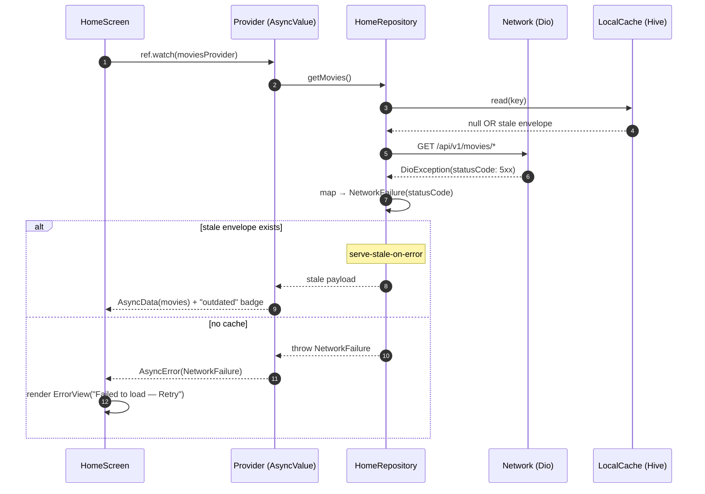
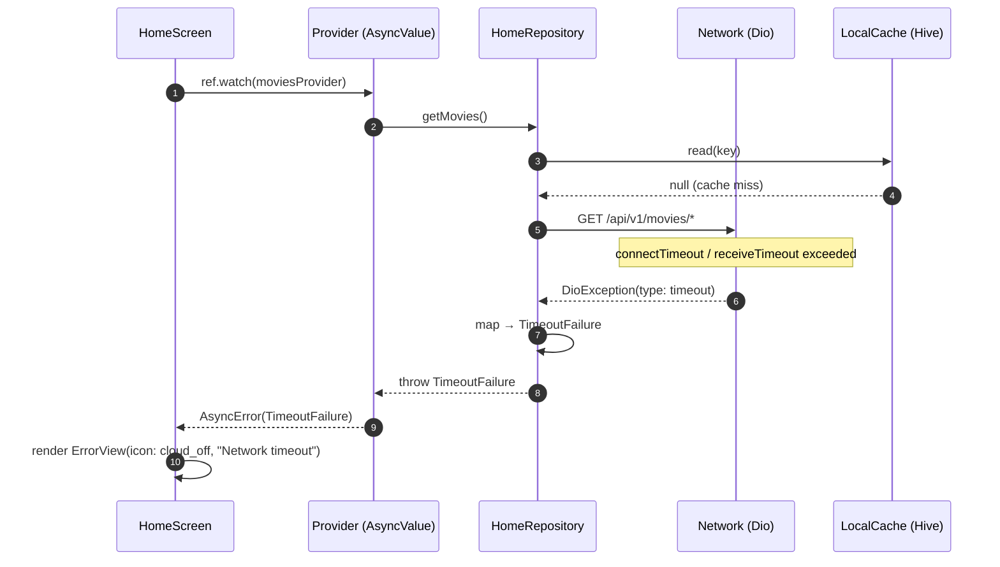
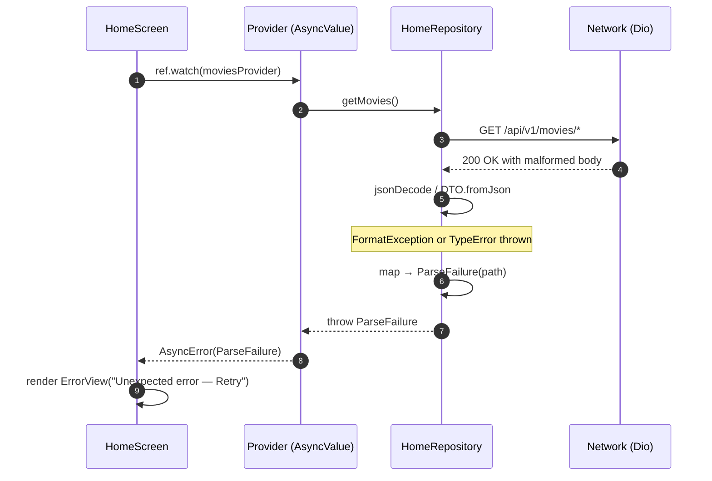
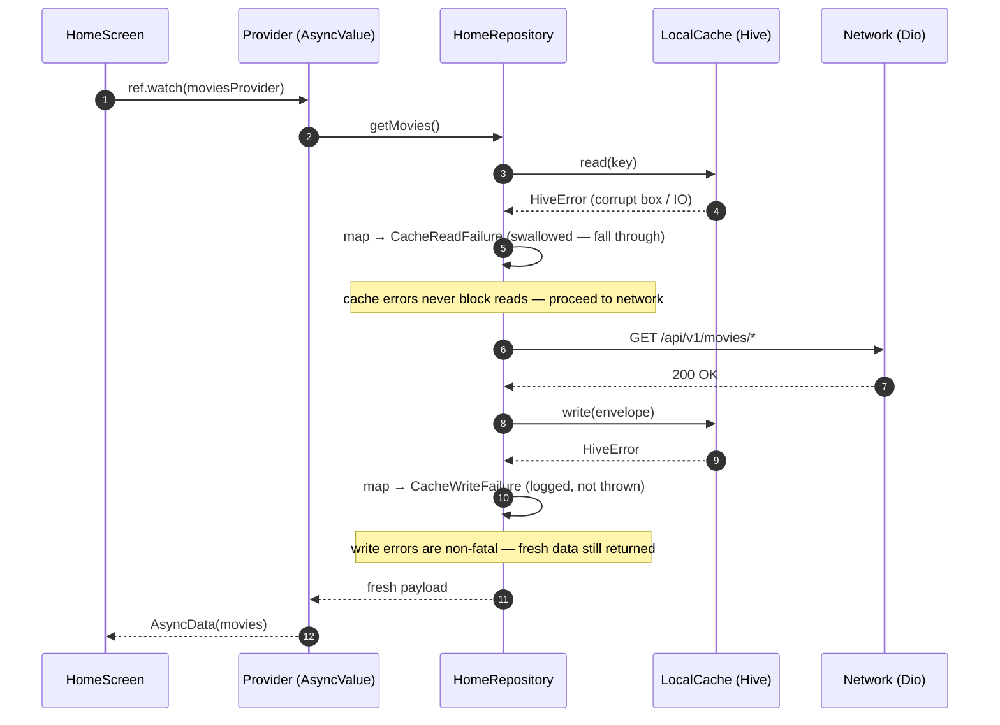

# System Architecture — ADF Cinema MVP

**Scope**: Complete architecture overview including layering, data flow, theming pipeline, routing, and error handling.  
**Last Updated**: 2026-05-28

---

## 1. High-Level Architecture Diagram

```
┌──────────────────────────────────────────────────────────────────┐
│                      Presentation Layer                          │
│  ┌─────────────────────────────────────────────────────────────┐ │
│  │  home_screen.dart + 20+ Widgets (UI tree)                   │ │
│  │  ├─ BannerCarousel (PageView, auto-rotate 5s)               │ │
│  │  ├─ MovieRail (horizontal scroll)                           │ │
│  │  ├─ CategoryChipsBar (filter chips)                         │ │
│  │  └─ ErrorView / ShimmerLoader (state variants)              │ │
│  └─────────────────────────────────────────────────────────────┘ │
│  ┌─────────────────────────────────────────────────────────────┐ │
│  │  Riverpod Providers (State Management)                       │ │
│  │  ├─ @riverpod bannersProvider                                │ │
│  │  ├─ @riverpod moviesProvider (filtered by category)          │ │
│  │  └─ @riverpod selectedCategoryProvider (state notifier)      │ │
│  └─────────────────────────────────────────────────────────────┘ │
└──────────────────────────────────────────────────────────────────┘
         ↓ (ref.watch / dependencies)
┌──────────────────────────────────────────────────────────────────┐
│                      Domain Layer (Business Logic)               │
│  ├─ HomeRepository (abstract interface)                          │
│  │  ├─ Future<List<Banner>> getBanners()                        │
│  │  ├─ Future<List<Movie>> getMoviesNowShowing()                │
│  │  ├─ Future<List<Movie>> getMoviesComingSoon()                │
│  │  └─ Future<List<Movie>> getRecommendedMovies()               │
│  └─ Entities (@freezed)                                          │
│     ├─ Banner {id, title, imageUrl, targetUrl}                 │
│     └─ Movie {id, title, posterUrl, rating, releaseDate}       │
└──────────────────────────────────────────────────────────────────┘
         ↓ (repository.get*)
┌──────────────────────────────────────────────────────────────────┐
│                      Data Layer (Sources & Persistence)          │
│  ┌──────────────────────┐  ┌─────────────────────────────────┐  │
│  │  Remote Source       │  │  Local Source (Cache)           │  │
│  │  (HomeRemoteSource)  │  │  (HomeLocalSource)              │  │
│  │                      │  │                                 │  │
│  │  ├─ Dio HTTP client  │  │  ├─ Hive KV store               │  │
│  │  ├─ /api/v1/*        │  │  ├─ CacheEnvelope + TTL         │  │
│  │  ├─ MockInterceptor  │  │  └─ Stale-While-Revalidate      │  │
│  │  └─ fixture loader   │  │     logic                       │  │
│  └──────────────────────┘  └─────────────────────────────────┘  │
│           ↕ (SWR orchestration)                                  │
│  HomeRepositoryImpl (orchestrates SWR flow)                       │
│  ├─ Check local cache TTL                                        │
│  ├─ If fresh → return + ignore network                           │
│  ├─ If stale → return + fetch in background                      │
│  └─ On error → fall back to cache                                │
│                                                                  │
│  DTOs (Data Transfer Objects)                                    │
│  ├─ @freezed BannerDto + mapper → Banner entity                  │
│  ├─ @freezed MovieDto + mapper → Movie entity                    │
│  └─ @freezed CachedEnvelope wrapper                              │
└──────────────────────────────────────────────────────────────────┘
         ↕ (network calls / storage ops)
┌──────────────────────────────────────────────────────────────────┐
│                    Core Infrastructure (Shared)                  │
│  ┌─────────────────────┐ ┌────────────────────────────────────┐ │
│  │  Network (core)     │ │  Storage (core)                    │ │
│  │                     │ │                                    │ │
│  │  ├─ DioClient       │ │  ├─ HiveBootstrap (init + boxes)  │ │
│  │  ├─ MockInterceptor │ │  ├─ LocalCache (typed read/write) │ │
│  │  │  └─ fixture JSON │ │  ├─ CacheEnvelope (TTL wrapper)   │ │
│  │  │     matching      │ │  └─ CachePolicy (isFresh logic)  │ │
│  │  ├─ NetworkConfig   │ │                                    │ │
│  │  └─ timeouts, flags │ │                                    │ │
│  └─────────────────────┘ └────────────────────────────────────┘ │
│  ┌─────────────────────┐ ┌────────────────────────────────────┐ │
│  │  Errors (core)      │ │  Theming (core)                    │ │
│  │                     │ │                                    │ │
│  │  Failure (sealed):  │ │  ├─ AppTheme (dark theme)          │ │
│  │  ├─ NetworkFailure  │ │  ├─ ThemeExtensions (colors,       │ │
│  │  ├─ TimeoutFailure  │ │  │  spacing, shapes)               │ │
│  │  ├─ ParseFailure    │ │  ├─ Generated tokens               │ │
│  │  ├─ CacheFailure    │ │  │  (from design system)           │ │
│  │  └─ UnknownFailure  │ │  └─ Material Design 3              │ │
│  └─────────────────────┘ └────────────────────────────────────┘ │
│  ┌─────────────────────────────────────────────────────────────┐ │
│  │  Navigation (core)                                          │ │
│  │  └─ tickets_fab_tile.dart (raised center FAB widget)        │ │
│  └─────────────────────────────────────────────────────────────┘ │
└──────────────────────────────────────────────────────────────────┘
```

---

## 2. Layered Architecture (Per-Feature)

```
Feature: home/
├─ presentation/
│  ├─ Screen          → Riverpod-aware widget tree
│  ├─ Providers       → Async state + filters
│  └─ Widgets         → Focused UI components
├─ domain/
│  ├─ Repository IF   → Abstract data contract
│  └─ Entities        → Business models (@freezed)
└─ data/
   ├─ Repository Impl → Orchestrates SWR + sources
   ├─ Sources         → Remote (Dio) + Local (Hive)
   └─ DTOs            → Network/storage serialization

Core (Shared):
├─ errors/           → Failure taxonomy
├─ network/          → Dio + MockInterceptor
├─ storage/          → Hive + LocalCache
├─ theme/            → Design tokens + theming
└─ navigation/       → Shared widgets (FAB)
```

**Dependencies**: Presentation → Domain ← Data → Core  
**No cycles**: Domain is independent; Core has no external dependencies.

---

## 3. Data Flow: Stale-While-Revalidate (SWR)

### Sequence Diagram

```
User opens Home Screen
    ↓
Riverpod notifier starts provider
    ↓
Repository.getBanners() called
    ↓
┌───────────────────────────────────────────────────┐
│ 1. Check local cache (Hive)                       │
├───────────────────────────────────────────────────┤
│   → CacheEnvelope{payload, savedAt, version}     │
│   → CachePolicy.isFresh(savedAt, ttl=30min)?     │
└───────────────────────────────────────────────────┘
    ↓
┌─ YES (fresh) ─────────────┐
│                            │
│ Return cached data         │ 2. Async background refresh
│ immediately               │    (triggers without blocking)
│ (warm start <500ms)       │
│                            │   → Network fetch
└────────────────┬──────────┘    → Parse & update cache
                 ↓
            AsyncValue.data(cachedList)
                 ↓
            UI rebuilds with cached data
                 ↓
         (background fetch completes)
                 ↓
      → AsyncValue.data(freshList)
                 ↓
       UI rebuilds again (fresh data)


┌─ NO (stale/missing) ──────┐
│                            │
│ Network fetch (blocking)   │ 3. Cache empty / stale
│ (cold start <2s)           │
│                            │
└────────────────┬──────────┘
                 ↓
        DioClient.get(/api/v1/*)
                 ↓
    ┌─ Success ─────┬─ Timeout ─────┬─ Error (4xx/5xx) ┐
    │               │               │                  │
    │ Parse JSON    │ throw         │ throw            │
    │ → DTO list    │ Timeout       │ Network          │
    │ → Entity list │ Failure       │ Failure          │
    │               │               │                  │
    │ Cache write   │               │                  │
    │ (async)       │               │                  │
    │               │               │                  │
    └───┬───────────┴───────────────┴──────────────────┘
        ↓
   AsyncValue.data(freshList)  OR  AsyncValue.error(failure)
        ↓
   UI rebuilds with fresh data OR error view
```

### Code Example

```dart
// repository_impl.dart
@override
Future<List<Movie>> getMoviesNowShowing() async {
  // 1. Try cached first (non-blocking)
  try {
    final cached = _localSource.getMoviesNowShowing();
    if (cached != null && 
        _cachePolicy.isFresh(cached.savedAt, ttlMinutes: 30)) {
      // Fresh cache → return immediately
      return cached.payload.map((dto) => dto.toEntity()).toList();
    }
  } catch (e) {
    // Ignore cache read errors, proceed to network
  }

  // 2. Fetch from network (will block if cache miss)
  try {
    final fresh = await _remoteSource.getMoviesNowShowing();
    
    // 3. Update cache in background (async, don't await)
    _localSource.cacheMoviesNowShowing(fresh).ignore();
    
    return fresh;
  } on TimeoutFailure {
    // 4. On error, try returning stale cache
    try {
      final stale = _localSource.getMoviesNowShowing();
      if (stale != null) {
        // Return stale + show user "Outdated data" badge
        return stale.payload.map((dto) => dto.toEntity()).toList();
      }
    } catch (e) {
      // Fall through to rethrow network error
    }
    rethrow;
  }
}

// provider (presentation)
@riverpod
Future<List<Movie>> nowShowingMovies(NowShowingMoviesRef ref) async {
  final repo = ref.watch(homeRepositoryProvider);
  return repo.getMoviesNowShowing();
}

// widget usage
movies.when(
  data: (list) => MovieRail(movies: list),
  loading: () => MovieShimmerLoader(),
  error: (err, st) => ErrorView(
    onRetry: () => ref.invalidate(nowShowingMoviesProvider),
  ),
);
```

---

## 4. Cache Envelope & TTL Policy

### CacheEnvelope Schema

```dart
@freezed
class CacheEnvelope<T> with _$CacheEnvelope<T> {
  factory CacheEnvelope({
    required T payload,                    // Actual cached data
    required DateTime savedAt,             // Timestamp for TTL check
    @Default(1) int schemaVersion,        // For future migrations
  }) = _CacheEnvelope<T>;
}
```

### CachePolicy Logic

```dart
bool isFresh(DateTime savedAt, {required int ttlMinutes}) {
  final now = DateTime.now();
  final age = now.difference(savedAt);
  return age.inMinutes < ttlMinutes;
}
```

### TTL Configuration

| Cache Type | TTL | Rationale |
|---|---|---|
| Banners | 60 min | Low-change promo content |
| Now Showing | 30 min | Frequent updates (showtimes) |
| Coming Soon | 2 hours | Release dates are stable |
| Recommended | 24 hours | Personalized, can be stale |

---

## 5. Failure Taxonomy & Error Mapping

### Sealed Class Hierarchy

```dart
sealed class Failure implements Exception {
  final String message;
  final Object? cause;
  const Failure(this.message, [this.cause]);
}

// Network errors
final class NetworkFailure extends Failure {
  final int? statusCode;
  NetworkFailure(String message, [this.statusCode, Object? cause])
    : super(message, cause);
}

final class TimeoutFailure extends Failure {
  const TimeoutFailure([Object? cause])
    : super('Request timeout', cause);
}

// Parsing errors
final class ParseFailure extends Failure {
  final String? path;
  ParseFailure(String message, [this.path, Object? cause])
    : super(message, cause);
}

// Storage errors
final class CacheReadFailure extends Failure {
  final String boxName;
  CacheReadFailure(this.boxName, [Object? cause])
    : super('Cache read failed: $boxName', cause);
}

final class CacheWriteFailure extends Failure {
  final String boxName;
  CacheWriteFailure(this.boxName, [Object? cause])
    : super('Cache write failed: $boxName', cause);
}

// Fixture errors
final class FixtureMissingFailure extends Failure {
  final String assetPath;
  FixtureMissingFailure(this.assetPath, [Object? cause])
    : super('Fixture not found: $assetPath', cause);
}

// Catch-all
final class UnknownFailure extends Failure {
  const UnknownFailure(String message, [Object? cause])
    : super(message, cause);
}
```

### Exception Mapping Table

| Exception Source | Failure Class | Condition |
|---|---|---|
| `DioException` | `TimeoutFailure` | `.isConnectionTimeout` or `.type == receiveTimeout` |
| `DioException` | `NetworkFailure(statusCode: …)` | 4xx/5xx HTTP status |
| `DioException` | `NetworkFailure(message)` | Other network error |
| `FormatException` | `ParseFailure(path: …)` | JSON decode/format error |
| `TypeError` | `ParseFailure` | Type mismatch in JSON deserialization |
| `HiveError` | `CacheReadFailure` | Hive box read operation |
| `HiveError` | `CacheWriteFailure` | Hive box write operation |
| Asset missing | `FixtureMissingFailure` | Fixture JSON not found |
| `Exception` (other) | `UnknownFailure` | Unclassified / unexpected |

### Error Propagation Sequence Diagrams

The diagrams below show how errors flow from their origin (network/cache/parse) through the repository (where mapping to `Failure` happens) up to the UI (which receives `AsyncValue.error`). Layer-internal details (Dio interceptors, Hive box mechanics, fixture loading) live in [LLD § 7.4](./lld-home-mvp.md).

#### 5.1 Network 5xx / 4xx → `NetworkFailure`



#### 5.2 Request Timeout → `TimeoutFailure`



#### 5.3 Malformed JSON → `ParseFailure`



#### 5.4 Cache Read/Write Error → `CacheReadFailure` / `CacheWriteFailure`



### UI Error Handling Pattern

```dart
// In widget
movies.when(
  error: (err, st) {
    if (err is TimeoutFailure) {
      return ErrorView(
        icon: Icons.cloud_off,
        message: 'Network timeout. Check connection and try again.',
        actionLabel: 'Retry',
        onAction: () => ref.invalidate(moviesProvider),
      );
    } else if (err is NetworkFailure) {
      return ErrorView(
        icon: Icons.error_outline,
        message: 'Failed to load movies. Please try again.',
        actionLabel: 'Retry',
        onAction: () => ref.invalidate(moviesProvider),
      );
    } else if (err is CacheReadFailure) {
      // Rare: cache corruption
      return ErrorView(
        icon: Icons.warning,
        message: 'Cache error. Pull to refresh.',
        actionLabel: 'Retry',
        onAction: () => ref.invalidate(moviesProvider),
      );
    }
    return ErrorView(
      icon: Icons.question_mark,
      message: 'Unexpected error. Please try again.',
      actionLabel: 'Retry',
      onAction: () => ref.invalidate(moviesProvider),
    );
  },
);
```

---

## 6. Theming Pipeline

### Design System → Code Flow

```
docs/design-system/
├─ tokens.json             (Single source of truth)
│  ├─ colors: {primary, secondary, surface, error, ...}
│  ├─ spacing: {xs: 4, sm: 8, md: 16, lg: 24, xl: 32}
│  ├─ radius: {sm: 4, md: 8, lg: 16, xl: 24}
│  ├─ typography: {headingLarge, bodyLarge, labelSmall, ...}
│  └─ motion: {fastDuration, normalDuration, slowDuration}
│
└─ themes/
   ├─ dark.json           (M3 dark color scheme overrides)
   └─ light.json          (M3 light color scheme overrides, unused for MVP)

     ↓ (dart tool/gen_theme.dart)

lib/core/theme/generated/
├─ color_tokens.dart      (class ColorTokens with static constants)
├─ spacing_tokens.dart    (class SpacingTokens)
├─ radius_tokens.dart     (class RadiusTokens)
├─ typography_tokens.dart (class TypographyTokens)
└─ motion_tokens.dart     (class MotionTokens)

     ↓ (imported by)

lib/core/theme/extensions/
├─ app_colors_ext.dart    (ThemeExtension<AppColorsExt>)
├─ app_gradients_ext.dart (ThemeExtension<AppGradientsExt>)
└─ app_shape_ext.dart     (ThemeExtension<AppShapeExt>)

     ↓ (mounted in)

lib/core/theme/app_theme.dart
└─ AppTheme.dark() → ThemeData(
     colorScheme: darkColorScheme,
     extensions: [AppColorsExt(...), AppGradientsExt(...), AppShapeExt(...)],
   )

     ↓ (applied in)

lib/app/app.dart
└─ MaterialApp(theme: AppTheme.dark(), ...)

     ↓ (used in all widgets)

All widgets: Theme.of(context).extension<AppColorsExt>()!.accentDark
```

### Token Usage in Widgets

```dart
// ✅ Correct: theme tokens
Container(
  color: Theme.of(context).extension<AppColorsExt>()!.surfaceDim,
  padding: EdgeInsets.all(
    Theme.of(context).extension<AppSpacingExt>()!.md,  // 16
  ),
  decoration: BoxDecoration(
    borderRadius: BorderRadius.circular(
      Theme.of(context).extension<AppShapeExt>()!.radiusMd,  // 8
    ),
  ),
  child: Text(
    'Movie Title',
    style: Theme.of(context).extension<AppTypographyExt>()!.headingLarge,
  ),
);

// ❌ Wrong: hardcoded values
Container(
  color: Color(0xFF1A1A1A),  // NEVER
  padding: EdgeInsets.all(16),  // Magic number
  decoration: BoxDecoration(borderRadius: BorderRadius.circular(8)),  // Magic
);
```

### Codegen Command

```bash
# Run when tokens.json or themes/*.json change
dart tool/gen_theme.dart

# Outputs generated/* files and updates extension classes
# Always run after theme design changes
```

---

## 7. Routing & Shell Architecture

### StatefulShellRoute + Navigation Composition

**5-Branch Indexed Stack** with per-branch back-stack preservation:

```dart
GoRouter(
  initialLocation: '/home',
  routes: [
    StatefulShellRoute.indexedStack(
      builder: (context, state, navigationShell) =>
          HomeShell(navigationShell: navigationShell),
      branches: [
        Branch 0: /home (HomeScreen — wired),
        Branch 1: /explore (PlaceholderTab),
        Branch 2: /tickets (TicketsScreen),
        Branch 3: /saved (PlaceholderTab),
        Branch 4: /profile (PlaceholderTab),
      ],
    ),
  ],
);
```

### HomeShell Layout & FAB Integration

**HomeShell** (app/shell/home_shell.dart) — Scaffold that wraps all branches:

```
Scaffold(
  body: navigationShell (IndexedStack; preserves per-branch state)
  bottomNavigationBar: CinemaNavBar(
    currentIndex: navigationShell.currentIndex,
    onTap: (idx) → navigationShell.goBranch(idx)
  )
)
```

**CinemaNavBar** (shared/widgets/cinema_nav_bar.dart) — Custom 5-destination nav with center FAB:

```
Bottom Navigation Bar (Material 3)
├─ Slot 0: Home icon (ref.watch selected → goBranch(0))
├─ Slot 1: Explore icon (goBranch(1))
├─ Slot 2: [EMPTY — Reserved for FAB overlay]
├─ Slot 3: Saved icon (goBranch(3))
└─ Slot 4: Profile icon (goBranch(4))

  ↑ (Stack overlay above)
  └─ TicketsFabTile (core/navigation/tickets_fab_tile.dart)
     ├─ Raised 56×56 FAB with gradient
     ├─ Positioned at center over slot 2
     ├─ Taps → context.go('/tickets')
     └─ Stack(clipBehavior: Clip.none) allows overflow
```

**Back-Stack Behavior**: When user switches branches (e.g., Home → Explore → Home), the HomeScreen state is fully preserved (Riverpod providers still cached in memory). No re-init on return.

Navigation tap flow: `CinemaNavBar.onTap()` → `navigationShell.goBranch(idx)` → `StatefulShellRoute` switches `IndexedStack` index → `HomeShell` rebuilds (body changes, nav bar updates `currentIndex`).

---

## 8. Network Mocking Strategy

**MockInterceptor** intercepts `/api/v1/*` requests and returns fixture JSON (500–1000ms latency):

1. Request: `GET /api/v1/movies/now-showing`
2. MockInterceptor matches path → loads `assets/fixtures/now-showing.json`
3. Returns 200 with parsed fixture data (as if from real API)
4. DTO deserialization, cache write, entity mapping proceed normally
5. **Fixture-to-API parity**: Schema must match contracts in `docs/project-fsd.md`

**Backend Swap (Post-MVP)**: Set `--dart-define=USE_MOCK=false` → MockInterceptor disabled → requests hit real IMDB API. Same DTO/entity pipeline works unchanged.

**Fixture Location**: `assets/fixtures/{now-showing,coming-soon,recommended,banners}.json` match request paths.

---

## 9. Hive Storage & Bootstrap

**main.dart** calls `bootstrapHive()` before `ProviderScope`:
1. Initializes Hive; registers TypeAdapters (via `hive_registrar.g.dart`)
2. Opens 4 boxes: `banners`, `movies_now_showing`, `movies_coming_soon`, `movies_recommended`
3. Each box stores `CacheEnvelope<List<T>>` with TTL metadata

| Box | Type | TTL |
|---|---|---|
| `banners` | `CacheEnvelope<List<BannerDto>>` | 60 min |
| `movies_now_showing` | `CacheEnvelope<List<MovieDto>>` | 30 min |
| `movies_coming_soon` | `CacheEnvelope<List<MovieDto>>` | 2 hours |
| `movies_recommended` | `CacheEnvelope<List<MovieDto>>` | 24 hours |

**LocalCache** (core/storage/local_cache.dart) wraps Hive calls with typed read/write + error mapping.

---

## 10. State Management (Riverpod Codegen)

Providers fire on first `.watch()` (cold start) and persist in RAM until app terminates. Pull-to-refresh calls `ref.invalidate()` to force rebuild.

| Operation | Result |
|---|---|
| `ref.watch(bannersProvider)` | Subscribe; rebuild on change; AsyncValue.{loading,error,data} |
| `ref.read(repo)` | One-time read (no rebuild) |
| `ref.invalidate(bannersProvider)` | Force provider rebuild next access |
| `ref.watch(…select())` | Filtered watch; optimizes rebuilds |

**Lifecycle**: build() → async fetch → AsyncValue.loading → network/cache complete → AsyncValue.data/error → UI rebuilds. State persists in RAM; Hive cache survives app restart.

---

## 11. Data → UI Flow (Example)

HomeScreen → ref.watch(nowShowingProvider) → HomeRepositoryImpl (SWR: cache TTL check → remote fetch/cache write) → RemoteSource (Dio + MockInterceptor) → DTO deserialize + map to entity → AsyncValue.data → UI renders via .when() → theme tokens applied.

On error: Repository throws Failure → AsyncValue.error → UI shows ErrorView with retry.

---

## 12. Reference Diagrams

### Dependency Graph

```
Presentation
    ↓ (consumes)
Domain (Repository IF)
    ↓ (consumed by)
Data (Repository Impl)
    ↓ (uses)
┌─────────────────────┐
│ Core (Shared)       │
├─────────────────────┤
│ errors/             │
│ network/            │ (no dependencies on Data/Domain/Presentation)
│ storage/            │
│ theme/              │
│ navigation/         │
└─────────────────────┘
```

### Module Ownership

```
lib/
├─ main.dart          (owned by: bootstrap)
├─ app/               (owned by: routing team)
├─ core/              (owned by: platform team)
├─ features/home/     (owned by: home feature team)
├─ features/tickets/  (owned by: ticketing team)
└─ shared/            (owned by: shared team)
```

---

## 13. Performance Considerations

### Cold Start (<2s)
1. Hive box opens (50ms)
2. Network request to /api/v1/* (500–1000ms with mock latency)
3. JSON parse + DTO → Entity mapping (20ms)
4. Riverpod state update + UI build (100ms)
5. Image download + caching (300ms async)

### Warm Start (<500ms)
1. Cache TTL check (5ms)
2. DTO → Entity mapping from cache (10ms)
3. Riverpod state update (5ms)
4. UI build + render (50ms)
5. Images already cached (instant)

### Optimization Patterns
- **Image Caching**: Use `CachedNetworkImage` (async, with Hive backend)
- **Provider Selectors**: Use `.select()` to avoid unnecessary rebuilds
- **Lazy Loading**: Only watch providers for visible sections
- **Shimmer Skeletons**: Match final layout to reduce layout shifts

---

## 14. Reference Documents

- **[docs/project-fsd.md](project-fsd.md)** — API contracts and data models
- **[docs/lld-home-mvp.md](lld-home-mvp.md)** — Detailed network/storage design
- **[docs/code-standards.md](code-standards.md)** — File naming, layering, error mapping
- **[docs/codebase-summary.md](codebase-summary.md)** — File-by-file walkthrough
- **[plans/reports/hld-home-mvp.md](../plans/reports/hld-home-mvp.md)** — Architecture choices + constraints

---

**End of System Architecture**
