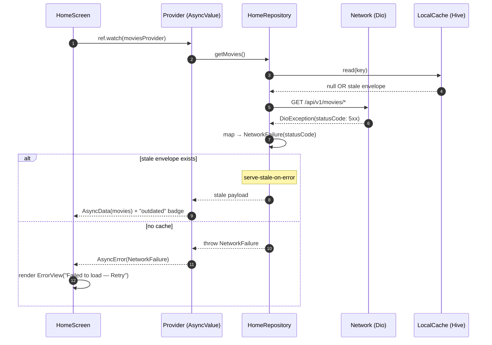
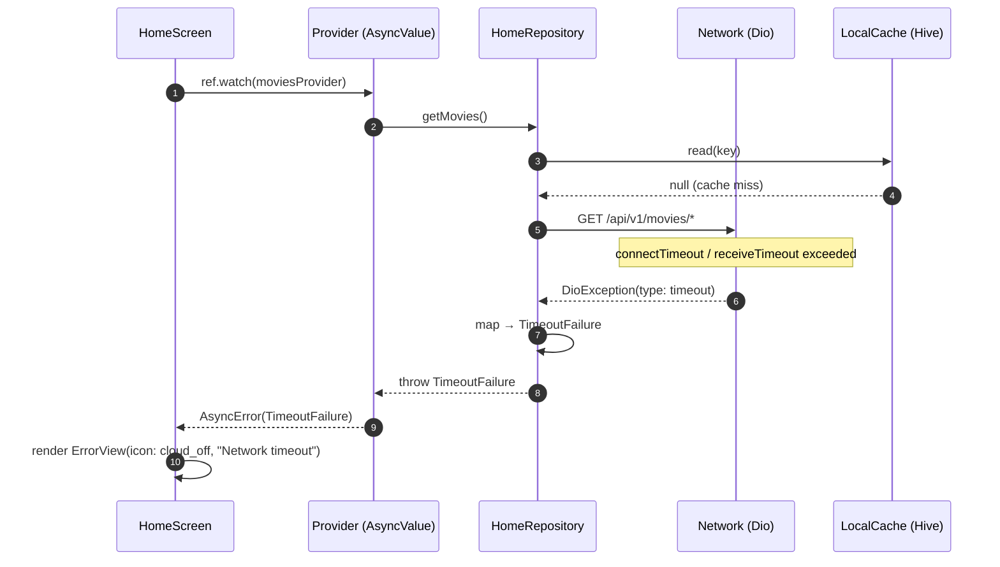
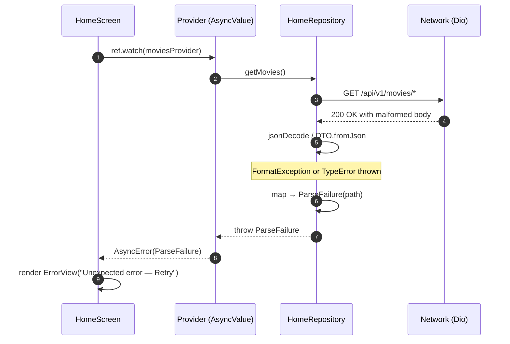
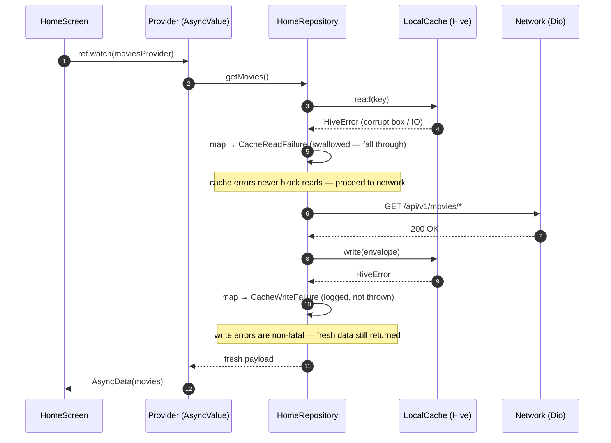

# System Architecture — ADF Cinema MVP

**Scope**: Complete architecture overview including layering, data flow, theming pipeline, routing, and error handling.  
**Last Updated**: 2026-05-28

---

## 1. High-Level Architecture Diagram

```
┌──────────────────────────────────────────────────────────────────┐
│                      Presentation Layer                          │
│  ┌─────────────────────────────────────────────────────────────┐ │
│  │  home_screen.dart + 20+ Widgets (UI tree)                   │ │
│  │  ├─ BannerCarousel (PageView, auto-rotate 5s)               │ │
│  │  ├─ MovieRail (horizontal scroll)                           │ │
│  │  ├─ CategoryChipsBar (filter chips)                         │ │
│  │  └─ ErrorView / ShimmerLoader (state variants)              │ │
│  └─────────────────────────────────────────────────────────────┘ │
│  ┌─────────────────────────────────────────────────────────────┐ │
│  │  Riverpod Providers (State Management)                       │ │
│  │  ├─ @riverpod bannersProvider                                │ │
│  │  ├─ @riverpod moviesProvider (filtered by category)          │ │
│  │  └─ @riverpod selectedCategoryProvider (state notifier)      │ │
│  └─────────────────────────────────────────────────────────────┘ │
└──────────────────────────────────────────────────────────────────┘
         ↓ (ref.watch / dependencies)
┌──────────────────────────────────────────────────────────────────┐
│                      Domain Layer (Business Logic)               │
│  ├─ HomeRepository (abstract interface)                          │
│  │  ├─ Future<List<Banner>> getBanners()                        │
│  │  ├─ Future<List<Movie>> getMoviesNowShowing()                │
│  │  ├─ Future<List<Movie>> getMoviesComingSoon()                │
│  │  └─ Future<List<Movie>> getRecommendedMovies()               │
│  └─ Entities (@freezed)                                          │
│     ├─ Banner {id, title, imageUrl, targetUrl}                 │
│     └─ Movie {id, title, posterUrl, rating, releaseDate}       │
└──────────────────────────────────────────────────────────────────┘
         ↓ (repository.get*)
┌──────────────────────────────────────────────────────────────────┐
│                      Data Layer (Sources & Persistence)          │
│  ┌──────────────────────┐  ┌─────────────────────────────────┐  │
│  │  Remote Source       │  │  Local Source (Cache)           │  │
│  │  (HomeRemoteSource)  │  │  (HomeLocalSource)              │  │
│  │                      │  │                                 │  │
│  │  ├─ Dio HTTP client  │  │  ├─ Hive KV store               │  │
│  │  ├─ /api/v1/*        │  │  ├─ CacheEnvelope + TTL         │  │
│  │  ├─ MockInterceptor  │  │  └─ Stale-While-Revalidate      │  │
│  │  └─ fixture loader   │  │     logic                       │  │
│  └──────────────────────┘  └─────────────────────────────────┘  │
│           ↕ (SWR orchestration)                                  │
│  HomeRepositoryImpl (orchestrates SWR flow)                       │
│  ├─ Check local cache TTL                                        │
│  ├─ If fresh → return + ignore network                           │
│  ├─ If stale → return + fetch in background                      │
│  └─ On error → fall back to cache                                │
│                                                                  │
│  DTOs (Data Transfer Objects)                                    │
│  ├─ @freezed BannerDto + mapper → Banner entity                  │
│  ├─ @freezed MovieDto + mapper → Movie entity                    │
│  └─ @freezed CachedEnvelope wrapper                              │
└──────────────────────────────────────────────────────────────────┘
         ↕ (network calls / storage ops)
┌──────────────────────────────────────────────────────────────────┐
│                    Core Infrastructure (Shared)                  │
│  ┌─────────────────────┐ ┌────────────────────────────────────┐ │
│  │  Network (core)     │ │  Storage (core)                    │ │
│  │                     │ │                                    │ │
│  │  ├─ DioClient       │ │  ├─ HiveBootstrap (init + boxes)  │ │
│  │  ├─ MockInterceptor │ │  ├─ LocalCache (typed read/write) │ │
│  │  │  └─ fixture JSON │ │  ├─ CacheEnvelope (TTL wrapper)   │ │
│  │  │     matching      │ │  └─ CachePolicy (isFresh logic)  │ │
│  │  ├─ NetworkConfig   │ │                                    │ │
│  │  └─ timeouts, flags │ │                                    │ │
│  └─────────────────────┘ └────────────────────────────────────┘ │
│  ┌─────────────────────┐ ┌────────────────────────────────────┐ │
│  │  Errors (core)      │ │  Theming (core)                    │ │
│  │                     │ │                                    │ │
│  │  Failure (sealed):  │ │  ├─ AppTheme (dark theme)          │ │
│  │  ├─ NetworkFailure  │ │  ├─ ThemeExtensions (colors,       │ │
│  │  ├─ TimeoutFailure  │ │  │  spacing, shapes)               │ │
│  │  ├─ ParseFailure    │ │  ├─ Generated tokens               │ │
│  │  ├─ CacheFailure    │ │  │  (from design system)           │ │
│  │  └─ UnknownFailure  │ │  └─ Material Design 3              │ │
│  └─────────────────────┘ └────────────────────────────────────┘ │
│  ┌─────────────────────────────────────────────────────────────┐ │
│  │  Navigation (core)                                          │ │
│  │  └─ tickets_fab_tile.dart (raised center FAB widget)        │ │
│  └─────────────────────────────────────────────────────────────┘ │
└──────────────────────────────────────────────────────────────────┘
```

---

## 2. Layered Architecture (Per-Feature)

```
Feature: home/
├─ presentation/
│  ├─ Screen          → Riverpod-aware widget tree
│  ├─ Providers       → Async state + filters
│  └─ Widgets         → Focused UI components
├─ domain/
│  ├─ Repository IF   → Abstract data contract
│  └─ Entities        → Business models (@freezed)
└─ data/
   ├─ Repository Impl → Orchestrates SWR + sources
   ├─ Sources         → Remote (Dio) + Local (Hive)
   └─ DTOs            → Network/storage serialization

Core (Shared):
├─ errors/           → Failure taxonomy
├─ network/          → Dio + MockInterceptor
├─ storage/          → Hive + LocalCache
├─ theme/            → Design tokens + theming
└─ navigation/       → Shared widgets (FAB)
```

**Dependencies**: Presentation → Domain ← Data → Core  
**No cycles**: Domain is independent; Core has no external dependencies.

---

## 3. Data Flow: Stale-While-Revalidate (SWR)

### Sequence Diagram

```
User opens Home Screen
    ↓
Riverpod notifier starts provider
    ↓
Repository.getBanners() called
    ↓
┌───────────────────────────────────────────────────┐
│ 1. Check local cache (Hive)                       │
├───────────────────────────────────────────────────┤
│   → CacheEnvelope{payload, savedAt, version}     │
│   → CachePolicy.isFresh(savedAt, ttl=30min)?     │
└───────────────────────────────────────────────────┘
    ↓
┌─ YES (fresh) ─────────────┐
│                            │
│ Return cached data         │ 2. Async background refresh
│ immediately               │    (triggers without blocking)
│ (warm start <500ms)       │
│                            │   → Network fetch
└────────────────┬──────────┘    → Parse & update cache
                 ↓
            AsyncValue.data(cachedList)
                 ↓
            UI rebuilds with cached data
                 ↓
         (background fetch completes)
                 ↓
      → AsyncValue.data(freshList)
                 ↓
       UI rebuilds again (fresh data)


┌─ NO (stale/missing) ──────┐
│                            │
│ Network fetch (blocking)   │ 3. Cache empty / stale
│ (cold start <2s)           │
│                            │
└────────────────┬──────────┘
                 ↓
        DioClient.get(/api/v1/*)
                 ↓
    ┌─ Success ─────┬─ Timeout ─────┬─ Error (4xx/5xx) ┐
    │               │               │                  │
    │ Parse JSON    │ throw         │ throw            │
    │ → DTO list    │ Timeout       │ Network          │
    │ → Entity list │ Failure       │ Failure          │
    │               │               │                  │
    │ Cache write   │               │                  │
    │ (async)       │               │                  │
    │               │               │                  │
    └───┬───────────┴───────────────┴──────────────────┘
        ↓
   AsyncValue.data(freshList)  OR  AsyncValue.error(failure)
        ↓
   UI rebuilds with fresh data OR error view
```

### Code Example

```dart
// repository_impl.dart
@override
Future<List<Movie>> getMoviesNowShowing() async {
  // 1. Try cached first (non-blocking)
  try {
    final cached = _localSource.getMoviesNowShowing();
    if (cached != null && 
        _cachePolicy.isFresh(cached.savedAt, ttlMinutes: 30)) {
      // Fresh cache → return immediately
      return cached.payload.map((dto) => dto.toEntity()).toList();
    }
  } catch (e) {
    // Ignore cache read errors, proceed to network
  }

  // 2. Fetch from network (will block if cache miss)
  try {
    final fresh = await _remoteSource.getMoviesNowShowing();
    
    // 3. Update cache in background (async, don't await)
    _localSource.cacheMoviesNowShowing(fresh).ignore();
    
    return fresh;
  } on TimeoutFailure {
    // 4. On error, try returning stale cache
    try {
      final stale = _localSource.getMoviesNowShowing();
      if (stale != null) {
        // Return stale + show user "Outdated data" badge
        return stale.payload.map((dto) => dto.toEntity()).toList();
      }
    } catch (e) {
      // Fall through to rethrow network error
    }
    rethrow;
  }
}

// provider (presentation)
@riverpod
Future<List<Movie>> nowShowingMovies(NowShowingMoviesRef ref) async {
  final repo = ref.watch(homeRepositoryProvider);
  return repo.getMoviesNowShowing();
}

// widget usage
movies.when(
  data: (list) => MovieRail(movies: list),
  loading: () => MovieShimmerLoader(),
  error: (err, st) => ErrorView(
    onRetry: () => ref.invalidate(nowShowingMoviesProvider),
  ),
);
```

---

## 4. Cache Envelope & TTL Policy

### CacheEnvelope Schema

```dart
@freezed
class CacheEnvelope<T> with _$CacheEnvelope<T> {
  factory CacheEnvelope({
    required T payload,                    // Actual cached data
    required DateTime savedAt,             // Timestamp for TTL check
    @Default(1) int schemaVersion,        // For future migrations
  }) = _CacheEnvelope<T>;
}
```

### CachePolicy Logic

```dart
bool isFresh(DateTime savedAt, {required int ttlMinutes}) {
  final now = DateTime.now();
  final age = now.difference(savedAt);
  return age.inMinutes < ttlMinutes;
}
```

### TTL Configuration

| Cache Type | TTL | Rationale |
|---|---|---|
| Banners | 60 min | Low-change promo content |
| Now Showing | 30 min | Frequent updates (showtimes) |
| Coming Soon | 2 hours | Release dates are stable |
| Recommended | 24 hours | Personalized, can be stale |

---

## 5. Failure Taxonomy & Error Mapping

### Sealed Class Hierarchy

```dart
sealed class Failure implements Exception {
  final String message;
  final Object? cause;
  const Failure(this.message, [this.cause]);
}

// Network errors
final class NetworkFailure extends Failure {
  final int? statusCode;
  NetworkFailure(String message, [this.statusCode, Object? cause])
    : super(message, cause);
}

final class TimeoutFailure extends Failure {
  const TimeoutFailure([Object? cause])
    : super('Request timeout', cause);
}

// Parsing errors
final class ParseFailure extends Failure {
  final String? path;
  ParseFailure(String message, [this.path, Object? cause])
    : super(message, cause);
}

// Storage errors
final class CacheReadFailure extends Failure {
  final String boxName;
  CacheReadFailure(this.boxName, [Object? cause])
    : super('Cache read failed: $boxName', cause);
}

final class CacheWriteFailure extends Failure {
  final String boxName;
  CacheWriteFailure(this.boxName, [Object? cause])
    : super('Cache write failed: $boxName', cause);
}

// Fixture errors
final class FixtureMissingFailure extends Failure {
  final String assetPath;
  FixtureMissingFailure(this.assetPath, [Object? cause])
    : super('Fixture not found: $assetPath', cause);
}

// Catch-all
final class UnknownFailure extends Failure {
  const UnknownFailure(String message, [Object? cause])
    : super(message, cause);
}
```

### Exception Mapping Table

| Exception Source | Failure Class | Condition |
|---|---|---|
| `DioException` | `TimeoutFailure` | `.isConnectionTimeout` or `.type == receiveTimeout` |
| `DioException` | `NetworkFailure(statusCode: …)` | 4xx/5xx HTTP status |
| `DioException` | `NetworkFailure(message)` | Other network error |
| `FormatException` | `ParseFailure(path: …)` | JSON decode/format error |
| `TypeError` | `ParseFailure` | Type mismatch in JSON deserialization |
| `HiveError` | `CacheReadFailure` | Hive box read operation |
| `HiveError` | `CacheWriteFailure` | Hive box write operation |
| Asset missing | `FixtureMissingFailure` | Fixture JSON not found |
| `Exception` (other) | `UnknownFailure` | Unclassified / unexpected |

### Error Propagation Sequence Diagrams

The diagrams below show how errors flow from their origin (network/cache/parse) through the repository (where mapping to `Failure` happens) up to the UI (which receives `AsyncValue.error`). Layer-internal details (Dio interceptors, Hive box mechanics, fixture loading) live in [LLD § 7.4](./lld-home-mvp.md).

#### 5.1 Network 5xx / 4xx → `NetworkFailure`



#### 5.2 Request Timeout → `TimeoutFailure`



#### 5.3 Malformed JSON → `ParseFailure`



#### 5.4 Cache Read/Write Error → `CacheReadFailure` / `CacheWriteFailure`



### UI Error Handling Pattern

```dart
// In widget
movies.when(
  error: (err, st) {
    if (err is TimeoutFailure) {
      return ErrorView(
        icon: Icons.cloud_off,
        message: 'Network timeout. Check connection and try again.',
        actionLabel: 'Retry',
        onAction: () => ref.invalidate(moviesProvider),
      );
    } else if (err is NetworkFailure) {
      return ErrorView(
        icon: Icons.error_outline,
        message: 'Failed to load movies. Please try again.',
        actionLabel: 'Retry',
        onAction: () => ref.invalidate(moviesProvider),
      );
    } else if (err is CacheReadFailure) {
      // Rare: cache corruption
      return ErrorView(
        icon: Icons.warning,
        message: 'Cache error. Pull to refresh.',
        actionLabel: 'Retry',
        onAction: () => ref.invalidate(moviesProvider),
      );
    }
    return ErrorView(
      icon: Icons.question_mark,
      message: 'Unexpected error. Please try again.',
      actionLabel: 'Retry',
      onAction: () => ref.invalidate(moviesProvider),
    );
  },
);
```

---

## 6. Theming Pipeline

### Design System → Code Flow

```
docs/design-system/
├─ tokens.json             (Single source of truth)
│  ├─ colors: {primary, secondary, surface, error, ...}
│  ├─ spacing: {xs: 4, sm: 8, md: 16, lg: 24, xl: 32}
│  ├─ radius: {sm: 4, md: 8, lg: 16, xl: 24}
│  ├─ typography: {headingLarge, bodyLarge, labelSmall, ...}
│  └─ motion: {fastDuration, normalDuration, slowDuration}
│
└─ themes/
   ├─ dark.json           (M3 dark color scheme overrides)
   └─ light.json          (M3 light color scheme overrides, unused for MVP)

     ↓ (dart tool/gen_theme.dart)

lib/core/theme/generated/
├─ color_tokens.dart      (class ColorTokens with static constants)
├─ spacing_tokens.dart    (class SpacingTokens)
├─ radius_tokens.dart     (class RadiusTokens)
├─ typography_tokens.dart (class TypographyTokens)
└─ motion_tokens.dart     (class MotionTokens)

     ↓ (imported by)

lib/core/theme/extensions/
├─ app_colors_ext.dart    (ThemeExtension<AppColorsExt>)
├─ app_gradients_ext.dart (ThemeExtension<AppGradientsExt>)
└─ app_shape_ext.dart     (ThemeExtension<AppShapeExt>)

     ↓ (mounted in)

lib/core/theme/app_theme.dart
└─ AppTheme.dark() → ThemeData(
     colorScheme: darkColorScheme,
     extensions: [AppColorsExt(...), AppGradientsExt(...), AppShapeExt(...)],
   )

     ↓ (applied in)

lib/app/app.dart
└─ MaterialApp(theme: AppTheme.dark(), ...)

     ↓ (used in all widgets)

All widgets: Theme.of(context).extension<AppColorsExt>()!.accentDark
```

### Token Usage in Widgets

```dart
// ✅ Correct: theme tokens
Container(
  color: Theme.of(context).extension<AppColorsExt>()!.surfaceDim,
  padding: EdgeInsets.all(
    Theme.of(context).extension<AppSpacingExt>()!.md,  // 16
  ),
  decoration: BoxDecoration(
    borderRadius: BorderRadius.circular(
      Theme.of(context).extension<AppShapeExt>()!.radiusMd,  // 8
    ),
  ),
  child: Text(
    'Movie Title',
    style: Theme.of(context).extension<AppTypographyExt>()!.headingLarge,
  ),
);

// ❌ Wrong: hardcoded values
Container(
  color: Color(0xFF1A1A1A),  // NEVER
  padding: EdgeInsets.all(16),  // Magic number
  decoration: BoxDecoration(borderRadius: BorderRadius.circular(8)),  // Magic
);
```

### Codegen Command

```bash
# Run when tokens.json or themes/*.json change
dart tool/gen_theme.dart

# Outputs generated/* files and updates extension classes
# Always run after theme design changes
```

---

## 7. Routing Architecture

### StatefulShellRoute (go_router)

```dart
// router.dart
final router = GoRouter(
  routes: [
    StatefulShellRoute.indexedStack(
      builder: (context, state, navigationShell) {
        return HomeShell(navigationShell: navigationShell);
      },
      branches: [
        // Branch 0: Home (wired)
        StatefulShellBranch(
          routes: [
            GoRoute(
              path: '/home',
              pageBuilder: (context, state) =>
                  NoTransitionPage(child: HomeScreen()),
            ),
          ],
        ),
        // Branch 1: Explore (placeholder)
        StatefulShellBranch(
          routes: [
            GoRoute(
              path: '/explore',
              pageBuilder: (context, state) =>
                  NoTransitionPage(child: PlaceholderTab()),
            ),
          ],
        ),
        // Branch 2: Tickets (placeholder)
        StatefulShellBranch(
          routes: [
            GoRoute(
              path: '/tickets',
              pageBuilder: (context, state) =>
                  NoTransitionPage(child: TicketsScreen()),
            ),
          ],
        ),
        // Branch 3: Saved (placeholder)
        StatefulShellBranch(
          routes: [
            GoRoute(
              path: '/saved',
              pageBuilder: (context, state) =>
                  NoTransitionPage(child: PlaceholderTab()),
            ),
          ],
        ),
        // Branch 4: Profile (placeholder)
        StatefulShellBranch(
          routes: [
            GoRoute(
              path: '/profile',
              pageBuilder: (context, state) =>
                  NoTransitionPage(child: PlaceholderTab()),
            ),
          ],
        ),
      ],
    ),
  ],
);
```

### Navigation Flow

```
App Launch
  ↓
GoRouter initial path: /home
  ↓
StatefulShellRoute.indexedStack
  ├─ navigationShell.currentIndex = 0
  └─ HomeShell(navigationShell)
       ├─ Scaffold
       ├─ body: HomeScreen() [Branch 0]
       └─ bottomNavigationBar: CinemaNavBar(
            onTap: (idx) => navigationShell.goBranch(idx)
          )

User taps Explore tab (index 1)
  ↓
CinemaNavBar.onTap(1)
  ↓
navigationShell.goBranch(1)
  ↓
StatefulShellRoute switches to Branch 1
  ├─ navigationShell.currentIndex = 1
  └─ HomeShell rebuilds
       └─ body: PlaceholderTab() [Branch 1]
           (Home state preserved in stack 0)

User taps Home tab (index 0)
  ↓
navigationShell.goBranch(0)
  ↓
HomeScreen restores (state preserved)
```

---

## 8. Network Mocking Strategy

### MockInterceptor Flow

```
App Start
  ↓
DioClient.dio.interceptors.add(MockInterceptor(...))
  ↓
User triggers data fetch
  ↓
Dio request: GET /api/v1/movies/now-showing?page=1&limit=10
  ↓
MockInterceptor.onRequest(request)
  ├─ Check: matches /api/v1/* pattern?
  │  └─ YES
  ├─ Simulate latency (500–1000ms)
  ├─ Load fixture: assets/fixtures/now-showing.json
  ├─ Parse JSON → Map
  └─ Return as fake response (status 200)

Response flows back to home_remote_source
  ↓
DTO deserialization
  ↓
Stored in Hive cache
  ↓
Mapped to entities
  ↓
UI rendered

---

Real Backend Swap (Post-MVP)

--dart-define=USE_MOCK=false
  ↓
network_config.dart: if (!useMock) DioClient(real base URL)
  ↓
MockInterceptor not added
  ↓
Requests go directly to real IMDB API
  ↓
(Same DTO/entity/repo flow works unchanged)
```

### Fixture Schema

```json
// assets/fixtures/now-showing.json
[
  {
    "id": "1",
    "title": "Inception",
    "posterUrl": "https://image.tmdb.org/t/p/w342/r2j02Z2OpNTctfOSN1cZGMLITVA.jpg",
    "rating": 8.8,
    "status": "now-showing",
    "releaseDate": "2026-01-15"
  },
  ...
]
```

---

## 9. Hive Storage Setup

### Bootstrap Sequence

```dart
// main.dart
void main() async {
  WidgetsFlutterBinding.ensureInitialized();
  
  // 1. Initialize Hive
  await bootstrapHive();
  
  // 2. Run app
  runApp(ProviderScope(child: AdfCinemaApp()));
}

// hive_bootstrap.dart
Future<void> bootstrapHive() async {
  // 1. Get app documents directory
  final dir = await getApplicationDocumentsDirectory();
  Hive.defaultDir = dir.path;

  // 2. Register TypeAdapters (generated)
  Hive.registerAdapter(BannerDtoAdapter());
  Hive.registerAdapter(MovieDtoAdapter());
  Hive.registerAdapter(CacheEnvelopeAdapter());
  // (all adapters via hive_registrar.g.dart)

  // 3. Open boxes
  await Hive.openBox<CacheEnvelope<List<BannerDto>>>('banners');
  await Hive.openBox<CacheEnvelope<List<MovieDto>>>('movies_now_showing');
  await Hive.openBox<CacheEnvelope<List<MovieDto>>>('movies_coming_soon');
  await Hive.openBox<CacheEnvelope<List<MovieDto>>>('movies_recommended');
}
```

### Box Schema

| Box Name | Type | Content | TTL |
|---|---|---|---|
| `banners` | `CacheEnvelope<List<BannerDto>>` | Featured content | 60 min |
| `movies_now_showing` | `CacheEnvelope<List<MovieDto>>` | Current releases | 30 min |
| `movies_coming_soon` | `CacheEnvelope<List<MovieDto>>` | Upcoming releases | 2 hours |
| `movies_recommended` | `CacheEnvelope<List<MovieDto>>` | Personalized | 24 hours |

---

## 10. State Management (Riverpod)

### Provider Lifecycle

```
App Start
  ↓
Provider not watched yet
  ├─ build() not called
  └─ Memory not allocated

User navigates to Home Screen
  ↓
Widget calls ref.watch(bannersProvider)
  ↓
Provider.build() executes
  ├─ Calls repo.getBanners()
  ├─ Returns Future
  └─ State = AsyncValue.loading

Network fetch completes
  ├─ State = AsyncValue.data([...])
  ├─ UI rebuilds with data
  └─ Provider maintains state in memory

User navigates away
  └─ If no other widgets watch it → still cached

App pauses / resumes
  ├─ Provider state persists (in RAM)
  └─ No automatic refresh (explicit via invalidate or pull-to-refresh)

User pulls to refresh
  ├─ ref.invalidate(bannersProvider)
  ├─ build() runs again
  ├─ State = AsyncValue.loading
  └─ (same flow as first load)

App terminated
  └─ Provider state lost (Hive cache persists across app restarts)
```

### Key Concepts

| Concept | Usage | Example |
|---|---|---|
| **@riverpod** | Mark provider function | `@riverpod Future<List<Banner>> banners(...) async { }` |
| **.watch()** | Subscribe to provider (rebuild on change) | `ref.watch(bannersProvider)` |
| **.read()** | Read provider once (no rebuild) | `ref.read(bannersProvider).maybeWhen(...)` |
| **.invalidate()** | Force rebuild next access | `ref.invalidate(bannersProvider)` |
| **AsyncValue** | Encodes loading/error/data state | `.when(loading: ..., error: ..., data: ...)` |
| **select()** | Subscribe to filtered value (optimize rebuilds) | `ref.watch(moviesProvider.select((async) => ...))` |

---

## 11. Integration Points

### Data → UI Flow (Example: Now Showing)

```
1. HomeScreen mounts
   ├─ ref.watch(nowShowingMoviesProvider)
   └─ AsyncValue<List<Movie>>

2. Provider subscribes to HomeRepository
   ├─ repo.getMoviesNowShowing()
   └─ Returns Future<List<Movie>>

3. Repository orchestrates:
   ├─ Check cache TTL (LocalSource)
   ├─ If fresh: return cached
   ├─ If stale: fetch + update cache
   └─ Throws Failure on error

4. Remote/Local sources:
   ├─ RemoteSource: Dio + MockInterceptor
   ├─ LocalSource: Hive + CachePolicy
   └─ Both map exceptions to Failure

5. Provider resolves:
   ├─ AsyncValue.loading → UI shows shimmer
   ├─ AsyncValue.data → UI shows movie list
   └─ AsyncValue.error → UI shows error view

6. Widget renders:
   ├─ NowShowingRail(movies: movieList)
   ├─ MovieCard(movie: movie)
   └─ All using theme tokens for styling
```

---

## 12. Reference Diagrams

### Dependency Graph

```
Presentation
    ↓ (consumes)
Domain (Repository IF)
    ↓ (consumed by)
Data (Repository Impl)
    ↓ (uses)
┌─────────────────────┐
│ Core (Shared)       │
├─────────────────────┤
│ errors/             │
│ network/            │ (no dependencies on Data/Domain/Presentation)
│ storage/            │
│ theme/              │
│ navigation/         │
└─────────────────────┘
```

### Module Ownership

```
lib/
├─ main.dart          (owned by: bootstrap)
├─ app/               (owned by: routing team)
├─ core/              (owned by: platform team)
├─ features/home/     (owned by: home feature team)
├─ features/tickets/  (owned by: ticketing team)
└─ shared/            (owned by: shared team)
```

---

## 13. Performance Considerations

### Cold Start (<2s)
1. Hive box opens (50ms)
2. Network request to /api/v1/* (500–1000ms with mock latency)
3. JSON parse + DTO → Entity mapping (20ms)
4. Riverpod state update + UI build (100ms)
5. Image download + caching (300ms async)

### Warm Start (<500ms)
1. Cache TTL check (5ms)
2. DTO → Entity mapping from cache (10ms)
3. Riverpod state update (5ms)
4. UI build + render (50ms)
5. Images already cached (instant)

### Optimization Patterns
- **Image Caching**: Use `CachedNetworkImage` (async, with Hive backend)
- **Provider Selectors**: Use `.select()` to avoid unnecessary rebuilds
- **Lazy Loading**: Only watch providers for visible sections
- **Shimmer Skeletons**: Match final layout to reduce layout shifts

---

## 14. Reference Documents

- **[docs/project-fsd.md](project-fsd.md)** — API contracts and data models
- **[docs/lld-home-mvp.md](lld-home-mvp.md)** — Detailed network/storage design
- **[docs/code-standards.md](code-standards.md)** — File naming, layering, error mapping
- **[docs/codebase-summary.md](codebase-summary.md)** — File-by-file walkthrough
- **[plans/reports/hld-home-mvp.md](../plans/reports/hld-home-mvp.md)** — Architecture choices + constraints

---

**End of System Architecture**
